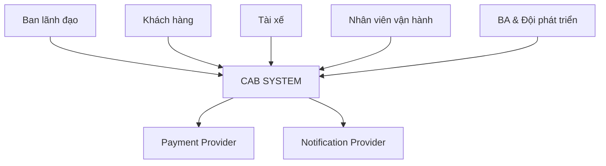
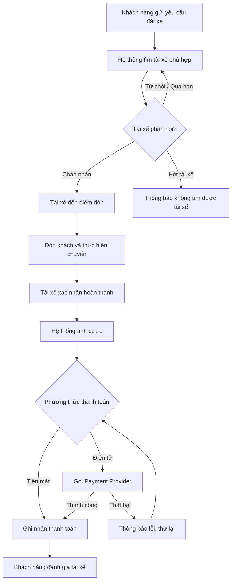
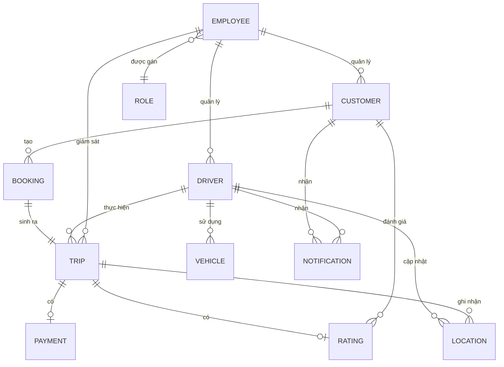

# CAB SYSTEM – Tài liệu phân tích nghiệp vụ

> Dự án: Nền tảng đặt xe CAB System – Công ty ABC
> Thời gian xây dựng và triển khai: 7 tuần

---

## 0. Actors

| STT | Actor | Vai trò |
|---:|---|---|
| 1 | **Khách hàng (Customer)** | Đăng ký/đăng nhập tài khoản, cập nhật thông tin cá nhân, nhập điểm đón - điểm đến, chọn loại xe và gửi yêu cầu đặt xe, theo dõi trạng thái/vị trí/ETA của chuyến, xem lịch sử chuyến đi, thanh toán và đánh giá tài xế sau khi hoàn thành chuyến. |
| 2 | **Tài xế (Driver)** | Đăng ký hoặc được cấp tài khoản, cập nhật hồ sơ và thông tin phương tiện, chuyển trạng thái sẵn sàng/không sẵn sàng nhận chuyến, nhận hoặc từ chối yêu cầu chuyến, cập nhật trạng thái chuyến (đã đến điểm đón, đã đón khách, đang di chuyển, hoàn thành) và cập nhật vị trí trong suốt chuyến đi. |
| 3 | **Nhân viên vận hành (Operation Staff)** | Quản lý thông tin khách hàng, tài xế và phương tiện; giám sát các chuyến đang diễn ra; hỗ trợ xử lý sự cố khi chuyến bị lỗi; tra cứu lịch sử giao dịch thanh toán. Một số thao tác nhạy cảm hơn (cấu hình hệ thống, phân quyền) chỉ dành riêng cho nhóm được cấp quyền cao hơn trong vai trò này. |
| 4 | **Ban lãnh đạo (Management)** | Xem báo cáo tổng hợp về số lượng chuyến, doanh thu, tỷ lệ hoàn thành/hủy chuyến và hiệu quả hoạt động của tài xế, phục vụ việc ra quyết định kinh doanh. |
| 5 | **Nhà cung cấp thanh toán bên ngoài (External Payment Provider)** | Xử lý giao dịch thanh toán điện tử thay cho hệ thống CAB; hệ thống CAB chỉ gửi yêu cầu thanh toán và nhận kết quả, không lưu trực tiếp thông tin thẻ/tài khoản thanh toán nhạy cảm. |
| 6 | **Nhà cung cấp thông báo (Notification Provider)** | Gửi thông báo (email, SMS, push notification...) tới khách hàng và tài xế khi có sự kiện quan trọng như tiếp nhận yêu cầu, tài xế nhận chuyến, tài xế đến điểm đón, hoàn thành chuyến, kết quả thanh toán; có thể mở rộng thêm kênh mới trong tương lai mà không ảnh hưởng hệ thống chính. |

---

## 1. Tìm kiếm Stakeholders quan trọng

| STT | Stakeholder | Loại | Mối quan tâm chính |
|---:|---|---|---|
| 1 | Ban lãnh đạo Công ty ABC | Nội bộ | Doanh thu, hiệu quả vận hành, khả năng mở rộng nền tảng |
| 2 | Khách hàng (Customer) | Bên ngoài | Đặt xe nhanh, minh bạch, thanh toán tiện lợi |
| 3 | Tài xế (Driver) | Bên ngoài | Nhận chuyến đều, thao tác đơn giản khi chạy |
| 4 | Nhân viên vận hành | Nội bộ | Công cụ quản lý, giám sát, xử lý sự cố |
| 5 | Nhà cung cấp thanh toán | Đối tác ngoài | Tích hợp đúng chuẩn, bảo mật giao dịch |
| 6 | Nhà cung cấp thông báo | Đối tác ngoài | Tích hợp gửi thông báo đa kênh |
| 7 | Đội phát triển & BA | Nội bộ dự án | Yêu cầu rõ ràng, phạm vi khả thi trong 7 tuần |

---

## 2. Sơ đồ Stakeholders và Stakeholders Matrix

### 2.1. Sơ đồ Stakeholders



### 2.2. Stakeholders Matrix (Quyền lực – Mức quan tâm)

| | Quan tâm thấp | Quan tâm cao |
|---|---|---|
| **Quyền lực cao** | – | Ban lãnh đạo, BA & Đội phát triển |
| **Quyền lực thấp** | Payment Provider, Notification Provider | Khách hàng, Tài xế, Nhân viên vận hành |

---

## 3. Business Goals (BG) và giới hạn module

### 3.1. Business Goals

| ID | Business Goal |
|---|---|
| BG1 | Cung cấp quy trình đặt xe trực tuyến thuận tiện, minh bạch cho khách hàng |
| BG2 | Tự động hóa việc tìm và ghép tài xế, giảm thời gian chờ xe |
| BG3 | Chuẩn hóa quản lý tài xế, phương tiện và trạng thái hoạt động |
| BG4 | Tự động hóa tính cước và hỗ trợ thanh toán an toàn, đa phương thức |
| BG5 | Đảm bảo thông tin được truyền đạt kịp thời qua hệ thống thông báo |
| BG6 | Nâng cao hiệu quả quản lý, giám sát vận hành và kiểm soát phân quyền |
| BG7 | Cung cấp báo cáo hỗ trợ ban lãnh đạo ra quyết định kinh doanh |
| BG8 | Xây dựng nền tảng ổn định, bảo mật và dễ mở rộng trong tương lai |

### 3.2. Giới hạn module (Scope)

| Trong phạm vi | Ngoài phạm vi |
|---|---|
| Đặt xe, ghép tài xế, thực hiện chuyến | Xây dựng cổng thanh toán riêng |
| Tính cước, thanh toán qua provider ngoài | Xây dựng hệ thống bản đồ riêng |
| Thông báo, đánh giá, lịch sử chuyến | Chương trình khuyến mãi, ví nội bộ |
| Quản lý vận hành, phân quyền, báo cáo | Ứng dụng cho khách hàng doanh nghiệp (B2B) |

---

## 4. Business Requirements (BR)

| ID | Business Requirement |
|---|---|
| BR01 | Cho phép khách hàng đăng ký, đăng nhập và cập nhật thông tin tài khoản |
| BR02 | Cho phép khách hàng đặt xe (điểm đón, điểm đến, loại xe) |
| BR03 | Cho phép khách hàng theo dõi trạng thái/vị trí/ETA và xem lịch sử chuyến |
| BR04 | Cho phép khách hàng đánh giá tài xế sau khi hoàn thành chuyến |
| BR05 | Cho phép tài xế quản lý tài khoản, hồ sơ và phương tiện |
| BR06 | Cho phép tài xế chuyển trạng thái sẵn sàng và nhận/từ chối chuyến |
| BR07 | Cho phép tài xế cập nhật trạng thái chuyến và vị trí |
| BR08 | Tự động tìm, ưu tiên ghép tài xế gần; tìm tài xế khác khi bị từ chối |
| BR09 | Tự động tính cước và hỗ trợ thanh toán tiền mặt/điện tử |
| BR10 | Gửi thông báo cho khách hàng và tài xế tại các mốc quan trọng |
| BR11 | Cho phép nhân viên vận hành quản lý, giám sát và xử lý sự cố |
| BR12 | Phân quyền các thao tác quản trị nhạy cảm |
| BR13 | Cung cấp báo cáo vận hành cho ban lãnh đạo |

---

## 5. Mô hình hóa quy trình nghiệp vụ (BPM)



---

## 6. Thiết kế chức năng nghiệp vụ

```text
CAB SYSTEM
├── 1. KHÁCH HÀNG
│   ├── Quản lý tài khoản
│   ├── Đặt xe
│   ├── Theo dõi chuyến đi
│   ├── Thanh toán
│   └── Lịch sử & Đánh giá
├── 2. TÀI XẾ
│   ├── Quản lý hồ sơ & phương tiện
│   ├── Trạng thái sẵn sàng
│   ├── Nhận/Từ chối chuyến
│   └── Cập nhật trạng thái & vị trí
├── 3. VẬN HÀNH
│   ├── Quản lý khách hàng/tài xế/phương tiện
│   ├── Giám sát chuyến & xử lý sự cố
│   ├── Tra cứu giao dịch
│   └── Phân quyền
├── 4. BÁO CÁO
│   └── Báo cáo chuyến, doanh thu, hiệu quả tài xế
└── 5. DỊCH VỤ TÍCH HỢP
    ├── Ghép tài xế & tính cước
    ├── Payment Provider
    └── Notification Provider
```

---

## 7. System Requirements (SR)

| ID | System Requirement | BR liên quan |
|---|---|---|
| SR01 | Hệ thống cho phép đăng ký, đăng nhập và xác thực người dùng | BR01, BR05 |
| SR02 | Hệ thống tiếp nhận yêu cầu đặt xe với điểm đón, điểm đến, loại xe | BR02 |
| SR03 | Hệ thống tự động tìm và ưu tiên tài xế gần, sẵn sàng | BR08 |
| SR04 | Hệ thống tự chuyển yêu cầu sang tài xế khác khi bị từ chối/quá hạn | BR08 |
| SR05 | Hệ thống cho phép tài xế nhận/từ chối và cập nhật trạng thái chuyến | BR06, BR07 |
| SR06 | Hệ thống hiển thị trạng thái, vị trí và ETA cho khách hàng | BR03 |
| SR07 | Hệ thống tự động tính cước sau khi chuyến hoàn thành | BR09 |
| SR08 | Hệ thống tích hợp Payment Provider và xử lý kết quả giao dịch | BR09 |
| SR09 | Hệ thống gửi thông báo qua Notification Provider | BR10 |
| SR10 | Hệ thống cung cấp giao diện quản trị cho nhân viên vận hành | BR11 |
| SR11 | Hệ thống kiểm soát quyền truy cập theo vai trò | BR12 |
| SR12 | Hệ thống tổng hợp và hiển thị báo cáo vận hành | BR13 |
| SR13 | Hệ thống lưu lịch sử chuyến và cho phép đánh giá tài xế | BR03, BR04 |

---

## 8. Business Rules

| ID | Business Rule |
|---|---|
| BRULE01 | Ưu tiên tài xế đang sẵn sàng và gần điểm đón nhất |
| BRULE02 | Tài xế phải phản hồi trong thời gian quy định, quá hạn coi như từ chối ⚠️ |
| BRULE03 | Khi tài xế từ chối/không phản hồi, hệ thống tự tìm tài xế khác |
| BRULE04 | Nếu không tìm được tài xế, phải thông báo rõ cho khách hàng |
| BRULE05 | Cước tính theo loại dịch vụ và thông tin chuyến ⚠️ |
| BRULE06 | Không lưu trực tiếp thông tin thẻ/tài khoản thanh toán trong hệ thống |
| BRULE07 | Thanh toán thất bại phải cho phép thử lại hoặc đổi phương thức |
| BRULE08 | Hủy chuyến phải theo điều kiện và thời điểm quy định ⚠️ |
| BRULE09 | Chuyến chỉ hoàn thành khi tài xế xác nhận kết thúc |
| BRULE10 | Người dùng chỉ thao tác được chức năng phù hợp vai trò |
| BRULE11 | Phải xác thực trước khi dùng chức năng yêu cầu tài khoản |
| BRULE12 | Các thao tác quan trọng phải được lưu vết |

> ⚠️ Các mục chưa được khách hàng chốt, cần BA làm rõ với stakeholder trước khi phát triển.

---

## 9. Yêu cầu phi chức năng (NFR)

| ID | Loại | Yêu cầu |
|---|---|---|
| NFR01 | Performance | Hệ thống phản hồi yêu cầu đặt xe và ghép tài xế trong thời gian ngắn, chấp nhận được với người dùng |
| NFR02 | Scalability | Các thành phần có thể mở rộng độc lập khi tải tăng vào giờ cao điểm |
| NFR03 | Availability | Lỗi ở chức năng thanh toán hoặc thông báo không làm ngừng toàn bộ hệ thống đặt xe |
| NFR04 | Security | Xác thực người dùng, kiểm soát quyền truy cập, bảo vệ dữ liệu cá nhân, vị trí và giao dịch |
| NFR05 | Auditability | Lưu vết các thao tác quan trọng phục vụ kiểm tra khi có sự cố |
| NFR06 | Maintainability | Có thể triển khai chức năng mới từng phần, hạn chế ảnh hưởng chức năng đang chạy |
| NFR07 | Extensibility | Dễ bổ sung loại dịch vụ, phương thức thanh toán, nhà cung cấp thông báo mới |

---

## 10. Xác định Entity và mô hình thực thể kết hợp

### 10.1. Xác định các Entity

| STT | Entity | Ý nghĩa |
|---:|---|---|
| 1 | CUSTOMER | Khách hàng sử dụng dịch vụ |
| 2 | DRIVER | Tài xế thực hiện chuyến |
| 3 | VEHICLE | Phương tiện của tài xế |
| 4 | BOOKING | Yêu cầu đặt xe của khách hàng |
| 5 | TRIP | Chuyến đi thực tế |
| 6 | PAYMENT | Giao dịch thanh toán |
| 7 | RATING | Đánh giá sau chuyến |
| 8 | LOCATION | Dữ liệu vị trí |
| 9 | NOTIFICATION | Thông báo gửi tới người dùng |
| 10 | EMPLOYEE | Nhân viên vận hành / ban lãnh đạo |
| 11 | ROLE | Vai trò và quyền hạn |

### 10.2. Xác định thuộc tính của các Entity

| Entity | Thuộc tính chính |
|---|---|
| CUSTOMER | customer_id, name, email, phone, password |
| DRIVER | driver_id, name, phone, status, rating |
| VEHICLE | vehicle_id, driver_id, license_plate, vehicle_type |
| BOOKING | booking_id, customer_id, pickup, destination, booking_time, status |
| TRIP | trip_id, booking_id, driver_id, start_time, end_time, fare, status |
| PAYMENT | payment_id, trip_id, amount, method, status, provider_ref |
| RATING | rating_id, trip_id, customer_id, score, comment |
| LOCATION | location_id, trip_id, driver_id, latitude, longitude, recorded_at |
| NOTIFICATION | notification_id, recipient_type, message, channel, created_at, status |
| EMPLOYEE | employee_id, name, email, role_id |
| ROLE | role_id, role_name, permissions |

### 10.3. Mối quan hệ giữa các Entity



---

## 11. Acceptance Criteria (AC)

| ID | Chức năng | Tiêu chí chấp nhận |
|---|---|---|
| AC01 | Đăng ký/Đăng nhập | Người dùng đăng ký được với thông tin hợp lệ và đăng nhập thành công khi xác thực đúng |
| AC02 | Đặt xe | Khách hàng nhập điểm đón, điểm đến, loại xe và gửi yêu cầu thành công |
| AC03 | Ghép tài xế | Hệ thống đề xuất tài xế sẵn sàng và gần khách hàng nhất |
| AC04 | Nhận/Từ chối chuyến | Tài xế chấp nhận hoặc từ chối được; nếu từ chối hệ thống tự tìm tài xế khác |
| AC05 | Cập nhật chuyến | Tài xế cập nhật được các mốc trạng thái và vị trí trong chuyến |
| AC06 | Theo dõi chuyến | Khách hàng xem được trạng thái, vị trí tài xế và ETA |
| AC07 | Tính cước | Hệ thống tự tính đúng số tiền sau khi chuyến hoàn thành |
| AC08 | Thanh toán | Khách hàng thanh toán được bằng tiền mặt hoặc điện tử và nhận kết quả |
| AC09 | Thanh toán lỗi | Khi giao dịch thất bại, hệ thống báo lỗi và cho thử lại/đổi phương thức |
| AC10 | Thông báo | Khách hàng và tài xế nhận được thông báo đúng mốc sự kiện |
| AC11 | Lịch sử & đánh giá | Khách hàng xem được lịch sử chuyến và đánh giá tài xế sau khi hoàn thành |
| AC12 | Quản lý vận hành | Nhân viên vận hành quản lý được khách hàng, tài xế, phương tiện, chuyến đi |
| AC13 | Phân quyền | Chỉ người đủ quyền mới thực hiện được thao tác quản trị nhạy cảm |
| AC14 | Báo cáo | Ban lãnh đạo xem được báo cáo số chuyến, doanh thu, tỷ lệ hủy, hiệu quả tài xế |

---

## 12. Bảng truy vết yêu cầu

| BG | BR | SR | AC |
|---|---|---|---|
| BG1 | BR01, BR02, BR03 | SR01, SR02, SR06 | AC01, AC02, AC06 |
| BG2 | BR08 | SR03, SR04 | AC03, AC04 |
| BG3 | BR05, BR06, BR07 | SR01, SR05 | AC01, AC05 |
| BG4 | BR09 | SR07, SR08 | AC07, AC08, AC09 |
| BG5 | BR10 | SR09 | AC10 |
| BG6 | BR11, BR12 | SR10, SR11 | AC12, AC13 |
| BG7 | BR13 | SR12 | AC14 |
| BG8 | BR04 | SR13 | AC11 |
| — | NFR01–NFR07 | — | Kiểm thử phi chức năng |
