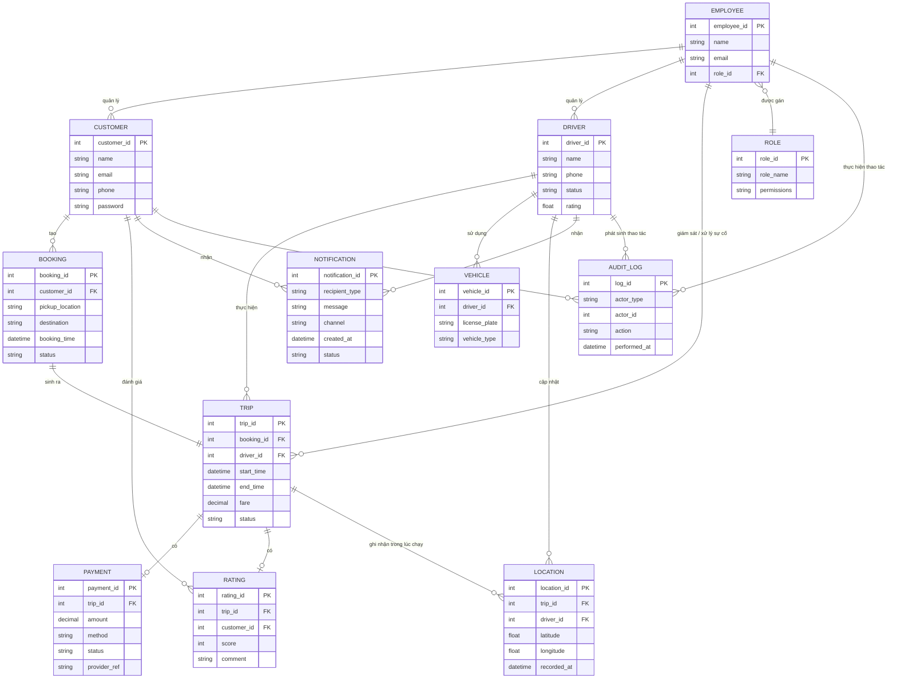

# Actor và Vai trò

| STT | Actor | Vai trò |
|---:|---|---|
| 1 | **Khách hàng (Customer)** | Đăng ký/đăng nhập tài khoản, cập nhật thông tin cá nhân, nhập điểm đón - điểm đến, chọn loại xe và gửi yêu cầu đặt xe, theo dõi trạng thái/vị trí/ETA của chuyến, xem lịch sử chuyến đi, thanh toán và đánh giá tài xế sau khi hoàn thành chuyến. |
| 2 | **Tài xế (Driver)** | Đăng ký hoặc được cấp tài khoản, cập nhật hồ sơ và thông tin phương tiện, chuyển trạng thái sẵn sàng/không sẵn sàng nhận chuyến, nhận hoặc từ chối yêu cầu chuyến, cập nhật trạng thái chuyến (đã đến điểm đón, đã đón khách, đang di chuyển, hoàn thành) và cập nhật vị trí trong suốt chuyến đi. |
| 3 | **Nhân viên vận hành (Operation Staff)** | Quản lý thông tin khách hàng, tài xế và phương tiện; giám sát các chuyến đang diễn ra; hỗ trợ xử lý sự cố khi chuyến bị lỗi; tra cứu lịch sử giao dịch thanh toán. Một số thao tác nhạy cảm hơn (cấu hình hệ thống, phân quyền) chỉ dành riêng cho nhóm được cấp quyền cao hơn trong vai trò này. |
| 4 | **Ban lãnh đạo (Management)** | Xem báo cáo tổng hợp về số lượng chuyến, doanh thu, tỷ lệ hoàn thành/hủy chuyến và hiệu quả hoạt động của tài xế, phục vụ việc ra quyết định kinh doanh. |
| 5 | **Nhà cung cấp thanh toán bên ngoài (External Payment Provider)** | Xử lý giao dịch thanh toán điện tử thay cho hệ thống CAB; hệ thống CAB chỉ gửi yêu cầu thanh toán và nhận kết quả, không lưu trực tiếp thông tin thẻ/tài khoản thanh toán nhạy cảm. |
| 6 | **Nhà cung cấp thông báo (Notification Provider)** | Gửi thông báo (email, SMS, push notification...) tới khách hàng và tài xế khi có sự kiện quan trọng như tiếp nhận yêu cầu, tài xế nhận chuyến, tài xế đến điểm đón, hoàn thành chuyến, kết quả thanh toán; có thể mở rộng thêm kênh mới trong tương lai mà không ảnh hưởng hệ thống chính. |

# Business Objectives
| STT | Yêu cầu / Kỳ vọng của khách hàng | Mục tiêu nghiệp vụ |
|---|---|---|
| BO1 | Khách hàng đăng ký, đăng nhập, cập nhật thông tin, đặt xe và theo dõi trạng thái/vị trí/ETA của chuyến theo thời gian thực | Cung cấp quy trình đặt xe trực tuyến thuận tiện, minh bạch và theo dõi được xuyên suốt hành trình |
| BO2 | Khách hàng xem lịch sử chuyến, số tiền đã trả và đánh giá tài xế sau khi hoàn thành | Lưu trữ đầy đủ dữ liệu giao dịch và trải nghiệm để khách hàng tra cứu, phản hồi chất lượng dịch vụ |
| BO3 | Tài xế đăng ký/được tạo tài khoản, cập nhật hồ sơ, thông tin phương tiện, trạng thái hoạt động và vị trí | Chuẩn hóa quản lý dữ liệu và trạng thái tài xế, hỗ trợ ghép tài xế chính xác và ước tính ETA tốt hơn |
| BO4 | Tài xế nhận thông báo chuyến mới, có thể chấp nhận/từ chối, cập nhật trạng thái trong suốt quá trình thực hiện chuyến | Đảm bảo tài xế phối hợp kịp thời với hệ thống trong toàn bộ vòng đời chuyến đi |
| BO5 | Hệ thống tự tìm tài xế phù hợp, ưu tiên tài xế gần; tự tìm tài xế khác nếu bị từ chối/không phản hồi; báo khách hàng nếu không tìm được | Tự động hóa quy trình ghép tài xế, đảm bảo yêu cầu đặt xe được xử lý liên tục và tăng tỷ lệ tìm được tài xế |
| BO6 | Tự động tính cước sau khi hoàn thành chuyến; hỗ trợ thanh toán tiền mặt và điện tử qua nhà cung cấp ngoài, không lưu thông tin nhạy cảm; xử lý lại khi giao dịch thất bại | Chuẩn hóa và tự động hóa quy trình tính cước, thanh toán, đồng thời giảm rủi ro bảo mật dữ liệu thanh toán |
| BO7 | Gửi thông báo cho khách hàng và tài xế ở các mốc quan trọng của chuyến; có thể mở rộng thêm kênh thông báo trong tương lai | Đảm bảo thông tin được truyền đạt kịp thời và kiến trúc thông báo linh hoạt, dễ mở rộng |
| BO8 | Nhân viên vận hành quản lý khách hàng, tài xế, phương tiện, chuyến đi, hỗ trợ xử lý sự cố; một số thao tác nhạy cảm cần được phân quyền | Nâng cao hiệu quả quản lý, giám sát vận hành và kiểm soát rủi ro từ thao tác trái phép |
| BO9 | Ban lãnh đạo cần báo cáo số chuyến, doanh thu, tỷ lệ hoàn thành/hủy, hiệu quả tài xế | Cung cấp dữ liệu và báo cáo hỗ trợ ra quyết định kinh doanh |
| BO10 | Hệ thống ổn định vào giờ cao điểm, lỗi ở một chức năng không làm sập toàn hệ thống, các thành phần mở rộng độc lập; xác thực người dùng, kiểm soát quyền truy cập, bảo vệ dữ liệu và lưu vết thao tác quan trọng; kiến trúc đủ linh hoạt để bổ sung dịch vụ/phương thức thanh toán/nhà cung cấp mới | Đảm bảo hệ thống có khả năng mở rộng, tính sẵn sàng, bảo mật và khả năng phục hồi, đồng thời dễ thích ứng với nhu cầu kinh doanh tương lai |
| BO11 | Doanh nghiệp chưa chốt cách tính cước, tiêu chí ưu tiên tài xế, thời gian phản hồi, chính sách hủy chuyến, xử lý mất kết nối, thời gian lưu trữ dữ liệu | Làm rõ và chuẩn hóa các quy tắc nghiệp vụ còn mơ hồ với các bên liên quan trước khi nhóm phát triển xây dựng giải pháp |

# CAB SYSTEM

## Sơ đồ 1 – Phân rã theo luồng xử lý nghiệp vụ

```text
                          CAB SYSTEM
                              │
        ┌──────────────┬──────────────┬──────────────┬──────────────┐
        │              │              │              │              │
        ▼              ▼              ▼              ▼              ▼
   1. ĐẶT XE     2. TÌM TÀI XẾ   3. THỰC HIỆN   4. TÍNH CƯỚC &   5. VẬN HÀNH
                                    CHUYẾN         THANH TOÁN      & BÁO CÁO
        │              │              │              │              │
        │              ▼              ▼              ▼              ▼
        │         Nhận/Từ chối   Cập nhật trạng   Tính cước    Quản lý KH/
        │          chuyến          thái chuyến                Tài xế/PT
        │              │              │              ▼              │
        │              ▼              ▼         Thanh toán          ▼
        │        Tìm tài xế     Cập nhật vị trí   (tiền mặt/    Giám sát &
        │        thay thế        tài xế           điện tử)     xử lý sự cố
        │                                              │              │
        └──────────────┴──────────────┴──────────────┴──────────────┘
                              │
                              ▼
                     THÔNG BÁO (xuyên suốt các bước)
                              │
                              ▼
                   Đánh giá tài xế (sau khi hoàn thành)
```

## Sơ đồ 2 – Phân rã theo Actor

```text
CAB SYSTEM
│
├── 1. CUSTOMER
│   ├── Quản lý tài khoản (đăng ký, đăng nhập, cập nhật thông tin)
│   ├── Đặt xe (điểm đón, điểm đến, loại xe)
│   ├── Theo dõi chuyến đi (trạng thái, vị trí, ETA)
│   ├── Xem lịch sử chuyến đi
│   ├── Thanh toán
│   └── Đánh giá tài xế
│
├── 2. DRIVER
│   ├── Quản lý tài khoản & hồ sơ tài xế
│   ├── Quản lý phương tiện
│   ├── Cập nhật trạng thái hoạt động (sẵn sàng/không sẵn sàng)
│   ├── Nhận / Từ chối chuyến
│   ├── Cập nhật trạng thái chuyến đi
│   └── Cập nhật vị trí trong chuyến
│
├── 3. OPERATION STAFF
│   ├── Quản lý khách hàng
│   ├── Quản lý tài xế & phương tiện
│   ├── Giám sát chuyến đi đang diễn ra
│   ├── Xử lý sự cố chuyến
│   ├── Tra cứu lịch sử giao dịch
│   └── Quản trị phân quyền (thao tác nhạy cảm)
│
├── 4. MANAGEMENT
│   └── Xem báo cáo (số chuyến, doanh thu, tỷ lệ hoàn thành/hủy, hiệu quả tài xế)
│
└── 5. SUPPORT SERVICES (hệ thống ngoài)
    ├── External Payment Provider (xử lý thanh toán điện tử)
    ├── Notification Provider (gửi thông báo đa kênh)
    └── Dịch vụ bản đồ / định vị (hỗ trợ tìm tài xế & ETA)
```
# Business Requirements

| ID | Business Requirement |
|---|---|
| **BR01** | Hệ thống phải cho phép **khách hàng đăng ký, đăng nhập và cập nhật thông tin tài khoản**. |
| **BR02** | Hệ thống phải cho phép **khách hàng đặt xe** bằng cách nhập điểm đón, điểm đến và chọn loại xe. |
| **BR03** | Hệ thống phải cho phép **khách hàng theo dõi trạng thái/vị trí/ETA của chuyến theo thời gian thực và xem lại lịch sử chuyến đi**. |
| **BR04** | Hệ thống phải cho phép **khách hàng đánh giá tài xế** sau khi chuyến đi hoàn thành. |
| **BR05** | Hệ thống phải cho phép **tài xế đăng ký/được cấp tài khoản**, cập nhật hồ sơ và thông tin phương tiện. |
| **BR06** | Hệ thống phải cho phép **tài xế chuyển trạng thái sẵn sàng nhận chuyến, cũng như nhận hoặc từ chối yêu cầu chuyến**. |
| **BR07** | Hệ thống phải cho phép **tài xế cập nhật trạng thái chuyến đi và vị trí** trong suốt quá trình thực hiện chuyến. |
| **BR08** | Hệ thống phải **tự động tìm và ưu tiên ghép tài xế phù hợp, gần khách hàng nhất**; nếu tài xế từ chối/không phản hồi thì tự tìm tài xế khác, và thông báo cho khách hàng nếu không tìm được ai phù hợp. |
| **BR09** | Hệ thống phải **tự động tính cước sau khi hoàn thành chuyến**, hỗ trợ thanh toán bằng tiền mặt hoặc điện tử qua nhà cung cấp bên ngoài, và xử lý/thông báo khi giao dịch thất bại. |
| **BR10** | Hệ thống phải **gửi thông báo** cho khách hàng và tài xế tại các mốc quan trọng của chuyến đi. |
| **BR11** | Hệ thống phải cho phép **nhân viên vận hành quản lý khách hàng, tài xế, phương tiện, giám sát chuyến đi, xử lý sự cố và tra cứu giao dịch**. |
| **BR12** | Hệ thống phải **phân quyền các thao tác quản trị nhạy cảm**, giới hạn không cho nhân viên vận hành thông thường thực hiện. |
| **BR13** | Hệ thống phải cung cấp cho **Ban lãnh đạo báo cáo** về số chuyến, doanh thu, tỷ lệ hoàn thành/hủy và hiệu quả hoạt động của tài xế. |

# Quy định nghiệp vụ – CAB System

| ID | Quy định nghiệp vụ | Mô tả |
|---|---|---|
| **BRULE01** | Ưu tiên tài xế gần khách hàng | Hệ thống ưu tiên ghép tài xế đang ở trạng thái sẵn sàng và có vị trí gần điểm đón nhất với khách hàng. |
| **BRULE02** | Thời gian phản hồi của tài xế | Tài xế được đề xuất phải chấp nhận hoặc từ chối chuyến trong một khoảng thời gian quy định; quá thời gian này được xem như không phản hồi. *(⚠️ chưa chốt cụ thể bao nhiêu giây/phút — cần xác nhận với khách hàng)* |
| **BRULE03** | Tìm tài xế thay thế | Nếu tài xế từ chối hoặc không phản hồi, hệ thống tự động chuyển yêu cầu sang tài xế phù hợp tiếp theo mà không yêu cầu khách hàng đặt lại. |
| **BRULE04** | Không tìm được tài xế | Nếu sau khi thử hết các tài xế phù hợp mà không ai nhận chuyến, hệ thống phải thông báo rõ cho khách hàng biết. |
| **BRULE05** | Cách tính cước | Cước chuyến đi được tính dựa trên loại dịch vụ và thông tin chuyến (quãng đường, thời gian...). *(⚠️ công thức/tiêu chí tính cước cụ thể chưa được chốt — cần làm rõ với khách hàng)* |
| **BRULE06** | Phương thức thanh toán | Khách hàng có thể thanh toán bằng tiền mặt hoặc điện tử qua nhà cung cấp thanh toán bên ngoài; thông tin thẻ/tài khoản nhạy cảm không được lưu trực tiếp trong hệ thống CAB. |
| **BRULE07** | Xử lý thanh toán thất bại | Nếu giao dịch thanh toán điện tử thất bại, hệ thống phải thông báo cho khách hàng và cho phép xử lý lại theo chính sách của doanh nghiệp. |
| **BRULE08** | Chính sách hủy chuyến | Khách hàng hoặc tài xế có thể hủy chuyến, nhưng phải theo điều kiện và thời điểm được quy định. *(⚠️ chính sách hủy cụ thể chưa được chốt — cần làm rõ với khách hàng)* |
| **BRULE09** | Hoàn thành chuyến | Chuyến chỉ được chuyển sang trạng thái hoàn thành khi tài xế xác nhận đã kết thúc chuyến. |
| **BRULE10** | Phân quyền thao tác | Người dùng chỉ được thực hiện các chức năng phù hợp với vai trò (Customer, Driver, Operation Staff, Management); các thao tác quản trị nhạy cảm chỉ dành cho nhân viên được cấp quyền cao hơn. |
| **BRULE11** | Xác thực trước khi sử dụng | Khách hàng và tài xế phải được xác thực (đăng nhập hợp lệ) trước khi thực hiện bất kỳ chức năng nào yêu cầu tài khoản. |
| **BRULE12** | Lưu vết thao tác | Các thao tác quan trọng (đặt xe, nhận/hủy chuyến, thanh toán, thao tác quản trị...) phải được ghi lại để phục vụ kiểm tra, truy vết khi có sự cố. |
| **BRULE13** | Xử lý mất kết nối | Khi mất kết nối (tài xế/khách hàng), hệ thống cần có cơ chế xử lý phù hợp để không làm gián đoạn toàn bộ chuyến đi. *(⚠️ cách xử lý cụ thể chưa được chốt — cần làm rõ với khách hàng)* |
| **BRULE14** | Thời gian lưu trữ dữ liệu | Dữ liệu giao dịch, vị trí và lịch sử chuyến đi phải được lưu trữ trong một khoảng thời gian nhất định phục vụ tra cứu và báo cáo. *(⚠️ thời gian lưu trữ cụ thể chưa được chốt — cần làm rõ với khách hàng)* |

# Ngoại lệ – CAB System

| ID | Ngoại lệ | Cách xử lý |
|---|---|---|
| **EX01** | Không tìm được tài xế phù hợp | Hệ thống thông báo rõ cho khách hàng và cho phép gửi lại yêu cầu đặt xe. |
| **EX02** | Tài xế được đề xuất từ chối chuyến | Hệ thống tự động chuyển yêu cầu sang tài xế phù hợp tiếp theo mà không cần khách hàng đặt lại. |
| **EX03** | Tài xế không phản hồi trong thời gian quy định | Hết thời gian chờ, hệ thống coi như từ chối và tự động chuyển sang tài xế khác. |
| **EX04** | Khách hàng hủy chuyến | Hệ thống kiểm tra điều kiện/thời điểm hủy theo chính sách, cập nhật trạng thái chuyến và thông báo cho tài xế (nếu đã ghép). |
| **EX05** | Tài xế hủy chuyến sau khi đã nhận | Hệ thống thông báo cho khách hàng và tự động tìm tài xế thay thế nếu phù hợp. |
| **EX06** | Giao dịch thanh toán điện tử thất bại | Hệ thống thông báo lỗi cho khách hàng và cho phép thực hiện lại hoặc chọn phương thức thanh toán khác. |
| **EX07** | Nhà cung cấp thanh toán (Payment Provider) không phản hồi/gián đoạn | Hệ thống ghi nhận lỗi, không để chức năng khác (đặt xe, thực hiện chuyến) bị ảnh hưởng, và cho khách hàng thử lại sau. |
| **EX08** | Dịch vụ thông báo (Notification Provider) lỗi | Hệ thống ghi nhận lỗi nhưng vẫn tiếp tục xử lý nghiệp vụ chính (đặt xe, thanh toán...), không làm gián đoạn toàn hệ thống. |
| **EX09** | Mất kết nối với tài xế hoặc khách hàng trong lúc thực hiện chuyến | Hệ thống lưu trạng thái gần nhất, cố gắng khôi phục kết nối, và có cơ chế xử lý phù hợp để chuyến đi không bị mất dữ liệu. *(⚠️ chi tiết cách xử lý cụ thể chưa được khách hàng chốt)* |
| **EX10** | Người dùng thao tác vượt quyền hạn của vai trò | Hệ thống từ chối thao tác và thông báo người dùng không có quyền thực hiện chức năng đó. |
| **EX11** | Người dùng chưa xác thực cố truy cập chức năng yêu cầu tài khoản | Hệ thống từ chối và yêu cầu đăng nhập trước khi tiếp tục. |
| **EX12** | Một thành phần/chức năng gặp sự cố (ví dụ lỗi thanh toán, lỗi thông báo) | Hệ thống cô lập lỗi ở thành phần đó, không làm sập toàn bộ nền tảng, đồng thời ghi log để phục vụ điều tra sau này. |

# Entity Relationship Diagram – CAB System



# Use Case – CAB System

| ID | Use Case | Actor chính | Actor phụ |
|---|---|---|---|
| UC01 | Đăng ký / Đăng nhập tài khoản | Customer, Driver | — |
| UC02 | Cập nhật thông tin cá nhân / hồ sơ | Customer, Driver | — |
| UC03 | Đặt xe | Customer | — |
| UC04 | Tìm và ghép tài xế | System (nội bộ) | Driver |
| UC05 | Nhận / Từ chối chuyến | Driver | — |
| UC06 | Cập nhật trạng thái sẵn sàng nhận chuyến | Driver | — |
| UC07 | Cập nhật trạng thái và vị trí chuyến đi | Driver | — |
| UC08 | Theo dõi chuyến đi (trạng thái, vị trí, ETA) | Customer | — |
| UC09 | Xem lịch sử chuyến đi | Customer | — |
| UC10 | Tính cước chuyến đi | System (nội bộ) | — |
| UC11 | Thanh toán chuyến đi | Customer | External Payment Provider |
| UC12 | Xử lý thanh toán thất bại | Customer | External Payment Provider |
| UC13 | Đánh giá tài xế | Customer | — |
| UC14 | Gửi thông báo sự kiện chuyến đi | System (nội bộ) | Notification Provider |
| UC15 | Quản lý khách hàng | Operation Staff | — |
| UC16 | Quản lý tài xế và phương tiện | Operation Staff | — |
| UC17 | Giám sát chuyến đi & xử lý sự cố | Operation Staff | — |
| UC18 | Tra cứu lịch sử giao dịch | Operation Staff | — |
| UC19 | Phân quyền thao tác quản trị | Operation Staff | — |
| UC20 | Xem báo cáo vận hành (doanh thu, tỷ lệ hoàn thành/hủy, hiệu quả tài xế) | Management | — |

# Acceptance Criteria – CAB System

| ID | Use Case | Tiêu chí chấp nhận |
|---|---|---|
| AC01 | Đăng ký / Đăng nhập tài khoản | Customer/Driver đăng ký thành công với thông tin hợp lệ; đăng nhập thành công khi thông tin xác thực đúng, bị từ chối khi sai. |
| AC02 | Cập nhật thông tin cá nhân / hồ sơ | Customer/Driver cập nhật được thông tin và hệ thống lưu lại thay đổi ngay sau khi xác nhận. |
| AC03 | Đặt xe | Customer nhập điểm đón, điểm đến, chọn loại xe và gửi yêu cầu đặt xe thành công. |
| AC04 | Tìm và ghép tài xế | Hệ thống tự động đề xuất tài xế phù hợp và ưu tiên tài xế gần khách hàng nhất. |
| AC05 | Nhận / Từ chối chuyến | Driver có thể chấp nhận hoặc từ chối chuyến; nếu từ chối, hệ thống tự chuyển sang tài xế khác. |
| AC06 | Cập nhật trạng thái sẵn sàng nhận chuyến | Driver chuyển đổi được trạng thái sẵn sàng/không sẵn sàng, và chỉ được ghép chuyến khi đang ở trạng thái sẵn sàng. |
| AC07 | Cập nhật trạng thái và vị trí chuyến đi | Driver cập nhật được các mốc trạng thái chuyến (đến điểm đón, đón khách, di chuyển, hoàn thành) và vị trí theo thời gian thực. |
| AC08 | Theo dõi chuyến đi | Customer xem được trạng thái, vị trí tài xế và ETA cập nhật theo thời gian thực. |
| AC09 | Xem lịch sử chuyến đi | Customer xem được danh sách chuyến đã thực hiện kèm thông tin số tiền đã thanh toán. |
| AC10 | Tính cước chuyến đi | Hệ thống tự động tính đúng số tiền dựa trên loại dịch vụ và thông tin chuyến sau khi hoàn thành. |
| AC11 | Thanh toán chuyến đi | Customer thanh toán thành công bằng tiền mặt hoặc điện tử, và nhận được kết quả thanh toán rõ ràng. |
| AC12 | Xử lý thanh toán thất bại | Khi giao dịch điện tử thất bại, hệ thống thông báo lỗi và cho phép thử lại hoặc đổi phương thức khác. |
| AC13 | Đánh giá tài xế | Customer đánh giá được tài xế sau khi chuyến hoàn thành, không đánh giá được nếu chuyến chưa kết thúc. |
| AC14 | Gửi thông báo sự kiện chuyến đi | Customer và Driver nhận được thông báo đúng lúc tại các mốc quan trọng của chuyến. |
| AC15 | Quản lý khách hàng | Operation Staff xem, cập nhật được thông tin khách hàng. |
| AC16 | Quản lý tài xế và phương tiện | Operation Staff xem, cập nhật được thông tin tài xế và phương tiện. |
| AC17 | Giám sát chuyến đi & xử lý sự cố | Operation Staff xem được các chuyến đang diễn ra và xử lý được khi có sự cố phát sinh. |
| AC18 | Tra cứu lịch sử giao dịch | Operation Staff tìm và xem được chi tiết các giao dịch thanh toán đã thực hiện. |
| AC19 | Phân quyền thao tác quản trị | Chỉ nhân viên được cấp quyền mới thực hiện được thao tác quản trị nhạy cảm; người không đủ quyền bị từ chối. |
| AC20 | Xem báo cáo vận hành | Management xem được báo cáo số chuyến, doanh thu, tỷ lệ hoàn thành/hủy và hiệu quả tài xế theo đúng dữ liệu thực tế. |

# Bảng truy vết yêu cầu – CAB System

| BO | BR | UC | AC |
|---|---|---|---|
| BO1 | BR01, BR02, BR03 | UC01, UC02, UC03, UC08 | AC01, AC02, AC03, AC08 |
| BO2 | BR03, BR04 | UC09, UC13 | AC09, AC13 |
| BO3 | BR05 | UC01, UC02, UC06, UC07 | AC01, AC02, AC06, AC07 |
| BO4 | BR06, BR07 | UC05, UC07 | AC05, AC07 |
| BO5 | BR08 | UC04 | AC04 |
| BO6 | BR09 | UC10, UC11, UC12 | AC10, AC11, AC12 |
| BO7 | BR10 | UC14 | AC14 |
| BO8 | BR11, BR12 | UC15, UC16, UC17, UC18, UC19 | AC15, AC16, AC17, AC18, AC19 |
| BO9 | BR13 | UC20 | AC20 |
| BO10 | *(không map trực tiếp — thuộc phạm vi Non-Functional Requirements: ổn định, bảo mật, khả năng mở rộng)* | — | — |
| BO11 | *(không map trực tiếp — thuộc hoạt động phân tích: BA cần làm rõ các quy tắc còn mơ hồ, xem các mục ⚠️ trong bảng Quy định nghiệp vụ)* | — | — |
