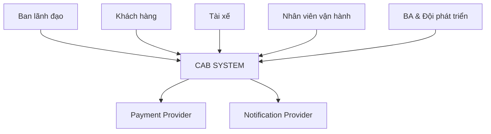
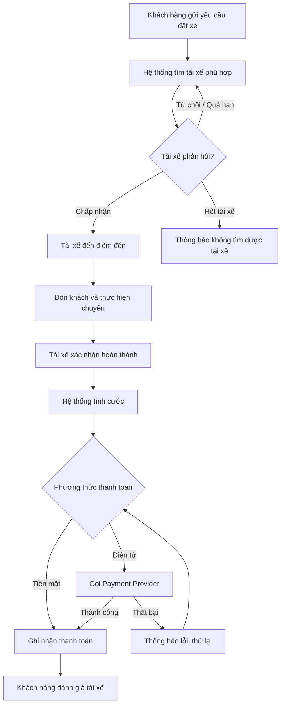
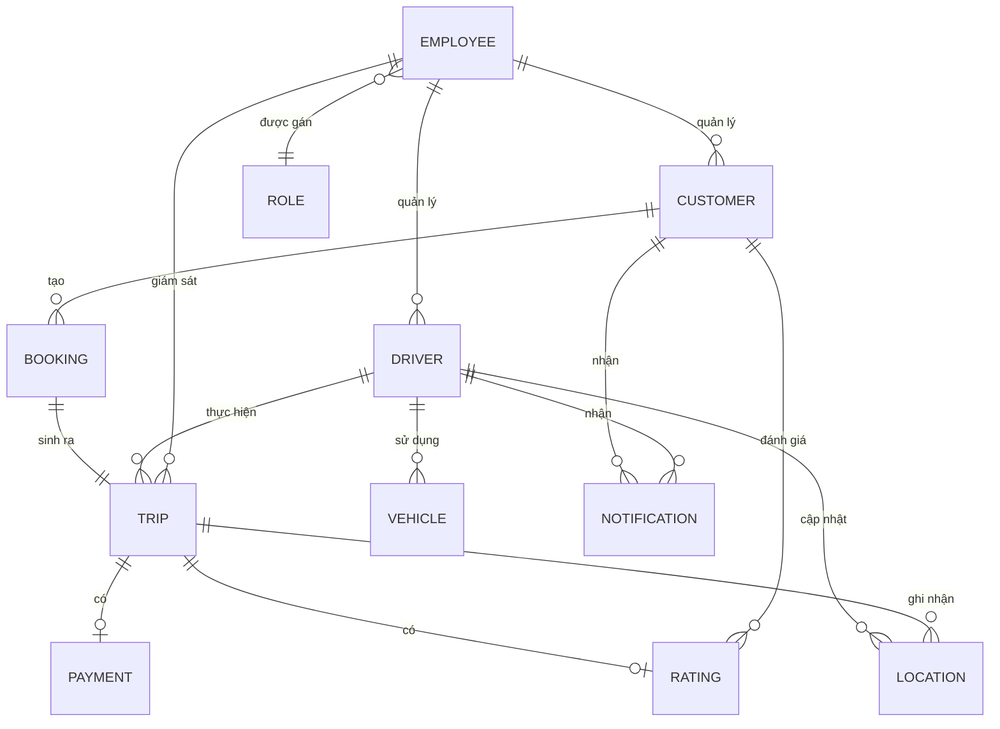

# CAB SYSTEM – Tài liệu phân tích nghiệp vụ

> Dự án: Nền tảng đặt xe CAB System – Công ty ABC
> Thời gian xây dựng và triển khai: 7 tuần

---

## 0. Actors

| STT | Actor | Vai trò |
|---:|---|---|
| 1 | **Khách hàng (Customer)** | Đăng ký/đăng nhập tài khoản, cập nhật thông tin cá nhân, nhập điểm đón - điểm đến, chọn loại xe và gửi yêu cầu đặt xe, theo dõi trạng thái/vị trí/ETA của chuyến, xem lịch sử chuyến đi, thanh toán và đánh giá tài xế sau khi hoàn thành chuyến. |
| 2 | **Tài xế (Driver)** | Đăng ký hoặc được cấp tài khoản, cập nhật hồ sơ và thông tin phương tiện, chuyển trạng thái sẵn sàng/không sẵn sàng nhận chuyến, nhận hoặc từ chối yêu cầu chuyến, cập nhật trạng thái chuyến (đã đến điểm đón, đã đón khách, đang di chuyển, hoàn thành) và cập nhật vị trí trong suốt chuyến đi. |
| 3 | **Nhân viên vận hành (Operation Staff)** | Quản lý thông tin khách hàng, tài xế và phương tiện; giám sát các chuyến đang diễn ra; hỗ trợ xử lý sự cố khi chuyến bị lỗi; tra cứu lịch sử giao dịch thanh toán. Một số thao tác nhạy cảm hơn (cấu hình hệ thống, phân quyền) chỉ dành riêng cho nhóm được cấp quyền cao hơn trong vai trò này. |
| 4 | **Ban lãnh đạo (Management)** | Xem báo cáo tổng hợp về số lượng chuyến, doanh thu, tỷ lệ hoàn thành/hủy chuyến và hiệu quả hoạt động của tài xế, phục vụ việc ra quyết định kinh doanh. |
| 5 | **Nhà cung cấp thanh toán bên ngoài (External Payment Provider)** | Xử lý giao dịch thanh toán điện tử thay cho hệ thống CAB; hệ thống CAB chỉ gửi yêu cầu thanh toán và nhận kết quả, không lưu trực tiếp thông tin thẻ/tài khoản thanh toán nhạy cảm. |
| 6 | **Nhà cung cấp thông báo (Notification Provider)** | Gửi thông báo (email, SMS, push notification...) tới khách hàng và tài xế khi có sự kiện quan trọng như tiếp nhận yêu cầu, tài xế nhận chuyến, tài xế đến điểm đón, hoàn thành chuyến, kết quả thanh toán; có thể mở rộng thêm kênh mới trong tương lai mà không ảnh hưởng hệ thống chính. |

---

## 1. Tìm kiếm Stakeholders quan trọng

| STT | Stakeholder | Loại | Mối quan tâm chính |
|---:|---|---|---|
| 1 | Ban lãnh đạo Công ty ABC | Nội bộ | Doanh thu, hiệu quả vận hành, khả năng mở rộng nền tảng |
| 2 | Khách hàng (Customer) | Bên ngoài | Đặt xe nhanh, minh bạch, thanh toán tiện lợi |
| 3 | Tài xế (Driver) | Bên ngoài | Nhận chuyến đều, thao tác đơn giản khi chạy |
| 4 | Nhân viên vận hành | Nội bộ | Công cụ quản lý, giám sát, xử lý sự cố |
| 5 | Nhà cung cấp thanh toán | Đối tác ngoài | Tích hợp đúng chuẩn, bảo mật giao dịch |
| 6 | Nhà cung cấp thông báo | Đối tác ngoài | Tích hợp gửi thông báo đa kênh |
| 7 | Đội phát triển & BA | Nội bộ dự án | Yêu cầu rõ ràng, phạm vi khả thi trong 7 tuần |

---

## 2. Sơ đồ Stakeholders và Stakeholders Matrix

### 2.1. Sơ đồ Stakeholders



### 2.2. Stakeholders Matrix (Quyền lực – Mức quan tâm)

| | Quan tâm thấp | Quan tâm cao |
|---|---|---|
| **Quyền lực cao** | – | Ban lãnh đạo, BA & Đội phát triển |
| **Quyền lực thấp** | Payment Provider, Notification Provider | Khách hàng, Tài xế, Nhân viên vận hành |

---

## 3. Business Goals (BG) và giới hạn module

### 3.1. Business Goals

| ID | Business Goal |
|---|---|
| BG1 | Cung cấp quy trình đặt xe trực tuyến thuận tiện, minh bạch cho khách hàng |
| BG2 | Tự động hóa việc tìm và ghép tài xế, giảm thời gian chờ xe |
| BG3 | Chuẩn hóa quản lý tài xế, phương tiện và trạng thái hoạt động |
| BG4 | Tự động hóa tính cước và hỗ trợ thanh toán an toàn, đa phương thức |
| BG5 | Đảm bảo thông tin được truyền đạt kịp thời qua hệ thống thông báo |
| BG6 | Nâng cao hiệu quả quản lý, giám sát vận hành và kiểm soát phân quyền |
| BG7 | Cung cấp báo cáo hỗ trợ ban lãnh đạo ra quyết định kinh doanh |
| BG8 | Xây dựng nền tảng ổn định, bảo mật và dễ mở rộng trong tương lai |

### 3.2. Giới hạn module (Scope)

| Trong phạm vi | Ngoài phạm vi |
|---|---|
| Đặt xe, ghép tài xế, thực hiện chuyến | Xây dựng cổng thanh toán riêng |
| Tính cước, thanh toán qua provider ngoài | Xây dựng hệ thống bản đồ riêng |
| Thông báo, đánh giá, lịch sử chuyến | Chương trình khuyến mãi, ví nội bộ |
| Quản lý vận hành, phân quyền, báo cáo | Ứng dụng cho khách hàng doanh nghiệp (B2B) |

---

## 4. Business Requirements (BR)

| ID | Business Requirement |
|---|---|
| BR01 | Cho phép khách hàng đăng ký, đăng nhập và cập nhật thông tin tài khoản |
| BR02 | Cho phép khách hàng đặt xe (điểm đón, điểm đến, loại xe) |
| BR03 | Cho phép khách hàng theo dõi trạng thái/vị trí/ETA và xem lịch sử chuyến |
| BR04 | Cho phép khách hàng đánh giá tài xế sau khi hoàn thành chuyến |
| BR05 | Cho phép tài xế quản lý tài khoản, hồ sơ và phương tiện |
| BR06 | Cho phép tài xế chuyển trạng thái sẵn sàng và nhận/từ chối chuyến |
| BR07 | Cho phép tài xế cập nhật trạng thái chuyến và vị trí |
| BR08 | Tự động tìm, ưu tiên ghép tài xế gần; tìm tài xế khác khi bị từ chối |
| BR09 | Tự động tính cước và hỗ trợ thanh toán tiền mặt/điện tử |
| BR10 | Gửi thông báo cho khách hàng và tài xế tại các mốc quan trọng |
| BR11 | Cho phép nhân viên vận hành quản lý, giám sát và xử lý sự cố |
| BR12 | Phân quyền các thao tác quản trị nhạy cảm |
| BR13 | Cung cấp báo cáo vận hành cho ban lãnh đạo |

---

## 5. Mô hình hóa quy trình nghiệp vụ (BPM)



---

## 6. Thiết kế chức năng nghiệp vụ

```text
CAB SYSTEM
├── 1. KHÁCH HÀNG
│   ├── Quản lý tài khoản
│   ├── Đặt xe
│   ├── Theo dõi chuyến đi
│   ├── Thanh toán
│   └── Lịch sử & Đánh giá
├── 2. TÀI XẾ
│   ├── Quản lý hồ sơ & phương tiện
│   ├── Trạng thái sẵn sàng
│   ├── Nhận/Từ chối chuyến
│   └── Cập nhật trạng thái & vị trí
├── 3. VẬN HÀNH
│   ├── Quản lý khách hàng/tài xế/phương tiện
│   ├── Giám sát chuyến & xử lý sự cố
│   ├── Tra cứu giao dịch
│   └── Phân quyền
├── 4. BÁO CÁO
│   └── Báo cáo chuyến, doanh thu, hiệu quả tài xế
└── 5. DỊCH VỤ TÍCH HỢP
    ├── Ghép tài xế & tính cước
    ├── Payment Provider
    └── Notification Provider
```

---

## 7. System Requirements (SR)

| ID | System Requirement | BR liên quan |
|---|---|---|
| SR01 | Hệ thống cho phép đăng ký, đăng nhập và xác thực người dùng | BR01, BR05 |
| SR02 | Hệ thống tiếp nhận yêu cầu đặt xe với điểm đón, điểm đến, loại xe | BR02 |
| SR03 | Hệ thống tự động tìm và ưu tiên tài xế gần, sẵn sàng | BR08 |
| SR04 | Hệ thống tự chuyển yêu cầu sang tài xế khác khi bị từ chối/quá hạn | BR08 |
| SR05 | Hệ thống cho phép tài xế nhận/từ chối và cập nhật trạng thái chuyến | BR06, BR07 |
| SR06 | Hệ thống hiển thị trạng thái, vị trí và ETA cho khách hàng | BR03 |
| SR07 | Hệ thống tự động tính cước sau khi chuyến hoàn thành | BR09 |
| SR08 | Hệ thống tích hợp Payment Provider và xử lý kết quả giao dịch | BR09 |
| SR09 | Hệ thống gửi thông báo qua Notification Provider | BR10 |
| SR10 | Hệ thống cung cấp giao diện quản trị cho nhân viên vận hành | BR11 |
| SR11 | Hệ thống kiểm soát quyền truy cập theo vai trò | BR12 |
| SR12 | Hệ thống tổng hợp và hiển thị báo cáo vận hành | BR13 |
| SR13 | Hệ thống lưu lịch sử chuyến và cho phép đánh giá tài xế | BR03, BR04 |

---

## 8. Business Rules

| ID | Business Rule |
|---|---|
| BRULE01 | Ưu tiên tài xế đang sẵn sàng và gần điểm đón nhất |
| BRULE02 | Tài xế phải phản hồi trong thời gian quy định, quá hạn coi như từ chối ⚠️ |
| BRULE03 | Khi tài xế từ chối/không phản hồi, hệ thống tự tìm tài xế khác |
| BRULE04 | Nếu không tìm được tài xế, phải thông báo rõ cho khách hàng |
| BRULE05 | Cước tính theo loại dịch vụ và thông tin chuyến ⚠️ |
| BRULE06 | Không lưu trực tiếp thông tin thẻ/tài khoản thanh toán trong hệ thống |
| BRULE07 | Thanh toán thất bại phải cho phép thử lại hoặc đổi phương thức |
| BRULE08 | Hủy chuyến phải theo điều kiện và thời điểm quy định ⚠️ |
| BRULE09 | Chuyến chỉ hoàn thành khi tài xế xác nhận kết thúc |
| BRULE10 | Người dùng chỉ thao tác được chức năng phù hợp vai trò |
| BRULE11 | Phải xác thực trước khi dùng chức năng yêu cầu tài khoản |
| BRULE12 | Các thao tác quan trọng phải được lưu vết |

> ⚠️ Các mục chưa được khách hàng chốt, cần BA làm rõ với stakeholder trước khi phát triển.

---

## 9. Yêu cầu phi chức năng (NFR)

| ID | Loại | Yêu cầu |
|---|---|---|
| NFR01 | Performance | Hệ thống phản hồi yêu cầu đặt xe và ghép tài xế trong thời gian ngắn, chấp nhận được với người dùng |
| NFR02 | Scalability | Các thành phần có thể mở rộng độc lập khi tải tăng vào giờ cao điểm |
| NFR03 | Availability | Lỗi ở chức năng thanh toán hoặc thông báo không làm ngừng toàn bộ hệ thống đặt xe |
| NFR04 | Security | Xác thực người dùng, kiểm soát quyền truy cập, bảo vệ dữ liệu cá nhân, vị trí và giao dịch |
| NFR05 | Auditability | Lưu vết các thao tác quan trọng phục vụ kiểm tra khi có sự cố |
| NFR06 | Maintainability | Có thể triển khai chức năng mới từng phần, hạn chế ảnh hưởng chức năng đang chạy |
| NFR07 | Extensibility | Dễ bổ sung loại dịch vụ, phương thức thanh toán, nhà cung cấp thông báo mới |

---

## 10. Xác định Entity và mô hình thực thể kết hợp

### 10.1. Xác định các Entity

| STT | Entity | Ý nghĩa |
|---:|---|---|
| 1 | CUSTOMER | Khách hàng sử dụng dịch vụ |
| 2 | DRIVER | Tài xế thực hiện chuyến |
| 3 | VEHICLE | Phương tiện của tài xế |
| 4 | BOOKING | Yêu cầu đặt xe của khách hàng |
| 5 | TRIP | Chuyến đi thực tế |
| 6 | PAYMENT | Giao dịch thanh toán |
| 7 | RATING | Đánh giá sau chuyến |
| 8 | LOCATION | Dữ liệu vị trí |
| 9 | NOTIFICATION | Thông báo gửi tới người dùng |
| 10 | EMPLOYEE | Nhân viên vận hành / ban lãnh đạo |
| 11 | ROLE | Vai trò và quyền hạn |

### 10.2. Xác định thuộc tính của các Entity

| Entity | Thuộc tính chính |
|---|---|
| CUSTOMER | customer_id, name, email, phone, password |
| DRIVER | driver_id, name, phone, status, rating |
| VEHICLE | vehicle_id, driver_id, license_plate, vehicle_type |
| BOOKING | booking_id, customer_id, pickup, destination, booking_time, status |
| TRIP | trip_id, booking_id, driver_id, start_time, end_time, fare, status |
| PAYMENT | payment_id, trip_id, amount, method, status, provider_ref |
| RATING | rating_id, trip_id, customer_id, score, comment |
| LOCATION | location_id, trip_id, driver_id, latitude, longitude, recorded_at |
| NOTIFICATION | notification_id, recipient_type, message, channel, created_at, status |
| EMPLOYEE | employee_id, name, email, role_id |
| ROLE | role_id, role_name, permissions |

### 10.3. Mối quan hệ giữa các Entity



---

## 11. Acceptance Criteria (AC)

| ID | Chức năng | Tiêu chí chấp nhận |
|---|---|---|
| AC01 | Đăng ký/Đăng nhập | Người dùng đăng ký được với thông tin hợp lệ và đăng nhập thành công khi xác thực đúng |
| AC02 | Đặt xe | Khách hàng nhập điểm đón, điểm đến, loại xe và gửi yêu cầu thành công |
| AC03 | Ghép tài xế | Hệ thống đề xuất tài xế sẵn sàng và gần khách hàng nhất |
| AC04 | Nhận/Từ chối chuyến | Tài xế chấp nhận hoặc từ chối được; nếu từ chối hệ thống tự tìm tài xế khác |
| AC05 | Cập nhật chuyến | Tài xế cập nhật được các mốc trạng thái và vị trí trong chuyến |
| AC06 | Theo dõi chuyến | Khách hàng xem được trạng thái, vị trí tài xế và ETA |
| AC07 | Tính cước | Hệ thống tự tính đúng số tiền sau khi chuyến hoàn thành |
| AC08 | Thanh toán | Khách hàng thanh toán được bằng tiền mặt hoặc điện tử và nhận kết quả |
| AC09 | Thanh toán lỗi | Khi giao dịch thất bại, hệ thống báo lỗi và cho thử lại/đổi phương thức |
| AC10 | Thông báo | Khách hàng và tài xế nhận được thông báo đúng mốc sự kiện |
| AC11 | Lịch sử & đánh giá | Khách hàng xem được lịch sử chuyến và đánh giá tài xế sau khi hoàn thành |
| AC12 | Quản lý vận hành | Nhân viên vận hành quản lý được khách hàng, tài xế, phương tiện, chuyến đi |
| AC13 | Phân quyền | Chỉ người đủ quyền mới thực hiện được thao tác quản trị nhạy cảm |
| AC14 | Báo cáo | Ban lãnh đạo xem được báo cáo số chuyến, doanh thu, tỷ lệ hủy, hiệu quả tài xế |

---

## 12. Bảng truy vết yêu cầu

| BG | BR | SR | AC |
|---|---|---|---|
| BG1 | BR01, BR02, BR03 | SR01, SR02, SR06 | AC01, AC02, AC06 |
| BG2 | BR08 | SR03, SR04 | AC03, AC04 |
| BG3 | BR05, BR06, BR07 | SR01, SR05 | AC01, AC05 |
| BG4 | BR09 | SR07, SR08 | AC07, AC08, AC09 |
| BG5 | BR10 | SR09 | AC10 |
| BG6 | BR11, BR12 | SR10, SR11 | AC12, AC13 |
| BG7 | BR13 | SR12 | AC14 |
| BG8 | BR04 | SR13 | AC11 |
| — | NFR01–NFR07 | — | Kiểm thử phi chức năng |

# Test Suite: Đánh Giá Chuyến Đi (Ride Rating & Feedback)

**Test Scenario:** Kiểm tra chức năng đánh giá chuyến đi

---

| Test Case ID | Test Case | Preconditions | Test Steps | Test Data | Expected Result | Priority |
| :--- | :--- | :--- | :--- | :--- | :--- | :--- |
| **TC_RATING_001** | Đánh giá 5 sao thành công kèm nhận xét văn bản | Chuyến xe đã hoàn thành và đã thanh toán; Đang ở màn hình đánh giá | 1. Chọn 5 sao<br>2. Nhập nội dung: "Tài xế thân thiện, xe sạch"<br>3. Nhấn "Gửi đánh giá" | Rating=5 Stars; Comment="Tài xế thân thiện, xe sạch" | Hệ thống ghi nhận đánh giá thành công, hiển thị thông báo "Cảm ơn bạn đã đánh giá!" và chuyển về Trang chủ. | High |
| **TC_RATING_002** | Đánh giá sao mà không nhập nhận xét văn bản (Comment optional) | Đang ở màn hình đánh giá chuyến đi | 1. Chọn 4 sao<br>2. Để trống ô nhận xét<br>3. Nhấn "Gửi đánh giá" | Rating=4 Stars; Comment="" | Đánh giá vẫn được gửi thành công mà không yêu cầu bắt buộc nhập nội dung văn bản. | Medium |
| **TC_RATING_003** | Chọn các thẻ tiêu chí nhanh (Quick Tags) khi đánh giá 5 sao | Đang ở màn hình đánh giá chuyến đi | 1. Chọn 5 sao<br>2. Nhấp chọn các tag: [Lái xe an toàn], [Xe sạch sẻ], [Đúng giờ]<br>3. Nhấn "Gửi" | Rating=5 Stars; Tags=["Lái xe an toàn", "Xe sạch sẻ", "Đúng giờ"] | Các tag tiêu chí được ghi nhận đúng vào dữ liệu đánh giá chất lượng tài xế. | Medium |
| **TC_RATING_004** | Đánh giá 1-2 sao hiển thị danh sách lý do góp ý xấu | Đang ở màn hình đánh giá chuyến đi | 1. Chọn 1 sao<br>2. Quan sát giao diện thay đổi<br>3. Chọn tag "Đi sai đường" và "Lái xe nhanh/thái độ kém"<br>4. Nhấn "Gửi" | Rating=1 Star; Negative Tags=["Đi sai đường", "Thái độ kém"] | Hệ thống tự động hiển thị các gợi ý lý do không hài lòng, ghi nhận đánh giá 1 sao và lý do tương ứng. | High |
| **TC_RATING_005** | Thưởng tiền Tip cho tài xế cùng lúc với đánh giá 5 sao | Chuyến xe đã hoàn thành; Tài khoản có liên kết phương thức thanh toán | 1. Chọn 5 sao<br>2. Chọn mức Tiền Tip: 10.000 VNĐ<br>3. Nhấn "Gửi đánh giá & Tip" | Rating=5 Stars; Tip=10.000 VNĐ; Payment=Momo | Trừ thành công 10.000 VNĐ qua ví/thẻ và gửi thông báo cộng tiền Tip cho tài xế. | High |
| **TC_RATING_006** | Nhập số tiền Tip tùy chỉnh (Custom Tip Amount) | Đang ở màn hình đánh giá và chọn Tip tiền | 1. Chọn ô "Số tiền khác"<br>2. Nhập số tiền 15.000 VNĐ<br>3. Nhấn "Xác nhận & Gửi" | Custom Tip=15.000 VNĐ | Hệ thống chấp nhận số tiền tip hợp lệ và thanh toán đúng 15.000 VNĐ. | Medium |
| **TC_RATING_007** | Nhập số tiền Tip không hợp lệ (Số âm hoặc quá hạn mức quy định) | Đang ở màn hình nhập tiền Tip tùy chỉnh | 1. Nhập số tiền Tip = 0 VNĐ hoặc 5.000.000 VNĐ (vượt trần quy định)<br>2. Nhấn "Xác nhận" | Custom Tip=-10.000 VNĐ hoặc 5.000.000 VNĐ | Hiển thị thông báo lỗi "Số tiền Tip không hợp lệ (Giới hạn từ 5.000 đến 500.000 VNĐ)". | Low |
| **TC_RATING_008** | Thao tác Bỏ qua đánh giá (Skip Rating) | Đang ở màn hình đánh giá chuyến đi | 1. Nhấn nút "Bỏ qua" hoặc icon "X" ở góc màn hình | Action=Skip | Thoát màn hình đánh giá, quay về trang chủ. Chuyến xe đóng trạng thái thành công mà không lưu số sao. | High |
| **TC_RATING_009** | Đánh giá lại chuyến xe cũ từ Lịch sử chuyến đi (History) | Chuyến xe đã hoàn thành nhưng khách bấm "Bỏ qua" trước đó; Chưa quá hạn thời gian đánh giá | 1. Vào Lịch sử chuyến đi<br>2. Chọn chuyến xe chưa đánh giá<br>3. Bấm "Đánh giá tài xế"<br>4. Chọn 5 sao và Gửi | Trip ID=TRIP_OLD_001; Rating=5 Stars | Gửi đánh giá thành công, trạng thái chuyến xe trong lịch sử chuyển thành "Đã đánh giá". | Medium |
| **TC_RATING_010** | Không cho phép đánh giá khi chuyến xe đã quá thời hạn cho phép | Chuyến xe đã hoàn thành quá 7 ngày (hoặc quá hạn quy định của hệ thống) | 1. Vào Lịch sử chuyến đi<br>2. Tìm chuyến xe hoàn thành cách đây 10 ngày | Trip ID=TRIP_EXPIRED_001; Completed Date=10 ngày trước | Nút "Đánh giá" bị ẩn/disabled hoặc hiển thị thông báo "Đã hết thời hạn đánh giá chuyến đi này". | Low |
| **TC_RATING_011** | Kiểm tra không cho phép Đánh giá lặp lại (Chỉ được đánh giá 1 lần/chuyến) | Chuyến xe đã được đánh giá thành công trước đó | 1. Mở chi tiết chuyến xe trong Lịch sử chuyến đi | Trip ID=TRIP_RATED_001 | Hiển thị số sao và nhận xét đã gửi trước đó, không còn nút "Gửi đánh giá" hay chỉnh sửa. | High |
| **TC_RATING_012** | Giới hạn độ dài ký tự nhận xét (Character Limit Validation) | Đang ở màn hình đánh giá chuyến đi | 1. Nhập đoạn văn bản nhận xét dài quá 500 ký tự<br>2. Quan sát bộ đếm ký tự và phản hồi giao diện | Comment Length = 550 ký tự | Ô văn bản chặn không cho nhập tiếp quá 500 ký tự hoặc báo lỗi "Nội dung nhận xét tối đa 500 ký tự". | Low |
| **TC_RATING_013** | Bộ lọc từ ngữ tục tĩu / Vi phạm tiêu chuẩn cộng đồng trong nhận xét | Đang ở màn hình đánh giá chuyến đi | 1. Nhập nhận xét chứa các từ ngữ xúc phạm, thô tục<br>2. Nhấn "Gửi đánh giá" | Comment="Tài xế ***** tục tĩu" | Hệ thống cảnh báo "Nội dung nhận xét chứa từ ngữ không phù hợp" và yêu cầu chỉnh sửa lại. | Medium |
| **TC_RATING_014** | Báo cáo sự cố an toàn / Báo xấu tài xế (Report Safety Issue) | Đang ở màn hình đánh giá (Chọn 1 sao) | 1. Nhấn nút "Báo cáo sự cố / An toàn"<br>2. Chọn lý do: "Tài xế phóng nhanh vượt ẩu / Quấy rối"<br>3. Nhấn "Gửi báo cáo" | Report Category=Safety Violation | Hệ thống tạo vé hỗ trợ (Ticket Support), chuyển thông tin tới bộ phận CSKH xử lý ưu tiên khẩn cấp. | High |
| **TC_RATING_015** | Tự động đồng bộ số sao trung bình (Average Rating) của tài xế | Tài xế đang có điểm rating trung bình là 4.8* (tổng 100 chuyến) | 1. Khách gửi đánh giá 5 sao cho tài xế<br>2. Kiểm tra lại hồ sơ tài xế trên hệ thống backend/app | Rating Input = 5 Stars | Điểm rating trung bình của tài xế được tính toán lại và cập nhật chính xác theo công thức. | High |
| **TC_RATING_016** | Xử lý mất kết nối mạng (Offline) khi đang nhấn Gửi đánh giá | Đang ở màn hình đánh giá | 1. Điền thông tin đánh giá<br>2. Tắt Wifi/4G<br>3. Nhấn "Gửi đánh giá" | Connection=Offline | Hiển thị thông báo "Lỗi kết nối mạng. Vui lòng kiểm tra lại Internet", giữ nguyên dữ liệu vừa nhập. | Medium |
| **TC_RATING_017** | Đánh giá chuyến xe bị Hủy giữa chừng (Cancelled Trip Rating) | Chuyến xe bị hủy sau khi tài xế đã đón khách (có phát sinh chi phí hủy/di chuyển) | 1. Mở màn hình thông báo hủy chuyến<br>2. Kiểm tra tùy chọn đánh giá trải nghiệm | Cancelled Trip ID=TRIP_CAN_001 | Hệ thống cho phép phản hồi/đánh giá lý do hủy chuyến để kiểm soát chất lượng phục vụ. | Low |
| **TC_RATING_018** | Chọn tùy chọn "Chặn không ghép chuyến với tài xế này trong tương lai" | Khách hàng đánh giá 1 sao cho tài xế | 1. Chọn 1 sao<br>2. Tích chọn "Không ghép chuyến với tài xế này nữa"<br>3. Nhấn "Gửi" | Rating=1 Star; Block Driver=True | Đánh giá được lưu, thuật toán xếp chuyến tự động chặn (Blacklist) tài xế này với tài khoản khách trong các chuyến sau. | Medium |
| **TC_RATING_019** | Giao diện hiển thị đúng ngôn ngữ hệ thống (Đa ngôn ngữ / Localization) | Ứng dụng đang cài đặt ngôn ngữ Tiếng Anh (English) | 1. Mở màn hình đánh giá chuyến đi<br>2. Kiểm tra các nhãn văn bản (Labels, Buttons, Tags) | App Language = English | Toàn bộ giao diện đánh giá hiển thị chuẩn Tiếng Anh (VD: "Rate your trip", "How was your driver?", "Submit"). | Low |
| **TC_RATING_020** | Kiểm tra ẩn danh tính của người đánh giá (Anonymous Rating) | Đánh giá được gửi thành công từ khách hàng | 1. Đăng nhập ứng dụng Tài xế để xem danh sách phản hồi/đánh giá nhận được | Driver Account View | Tài xế chỉ nhìn thấy số sao, tag góp ý và nội dung nhận xét, không hiển thị Tên hay Số điện thoại của khách hàng. | High |

# Test Suite: Theo Dõi Chuyến Xe (Trip Tracking / Live Tracking)

**Test Scenario:** Kiểm tra chức năng theo dõi chuyến xe theo thời gian thực

---

| Test Case ID | Test Case | Preconditions | Test Steps | Test Data | Expected Result | Priority |
| :--- | :--- | :--- | :--- | :--- | :--- | :--- |
| **TC_TRACK_001** | Kiểm tra hiển thị vị trí thực của tài xế trên bản đồ (Real-time GPS) | Tài xế đã nhận chuyến và đang di chuyển tới điểm đón | 1. Mở màn hình theo dõi chuyến xe<br>2. Quan sát icon tài xế di chuyển trên bản đồ | Status=Driver Accepted | Icon tài xế di chuyển mượt mà trên bản đồ theo vị trí GPS thực tế, không bị giật lag lớn. | High |
| **TC_TRACK_002** | Hiển thị chính xác thời gian dự kiến đến (ETA) và khoảng cách | Màn hình theo dõi chuyến xe đang bật | 1. Quan sát thông tin ETA và khoảng cách hiển thị<br>2. So sánh khi tài xế di chuyển gần hơn | ETA & Distance Labels | Thời gian dự kiến (ETA) và số km/m giảm dần chính xác khi tài xế tiến lại gần điểm đón/điểm đến. | High |
| **TC_TRACK_003** | Hiển thị đường đi dự kiến (Route Line) | Tài xế đang thực hiện chuyến xe | 1. Mở màn hình bản đồ theo dõi<br>2. Kiểm tra đường đi kẻ trên bản đồ | Route Navigation | Hiển thị rõ đường đi đề xuất (Route line) từ vị trí tài xế đến điểm đón hoặc điểm trả khách. | High |
| **TC_TRACK_004** | Kiểm tra thông tin tài xế và phương tiện | Chuyến xe đã có tài xế nhận | 1. Mở thẻ thông tin tài xế ở góc dưới màn hình<br>2. Kiểm tra các trường dữ liệu | Driver Info Panel | Hiển thị đúng Họ tên, Ảnh đại diện, Biển số xe, Hãng xe/Dòng xe và Điểm đánh giá (Rating) của tài xế. | High |
| **TC_TRACK_005** | Thực hiện gọi điện trực tiếp cho tài xế | Màn hình theo dõi chuyến xe đang mở | 1. Nhấn vào icon/nút "Gọi điện"<br>2. Kiểm tra ứng dụng cuộc gọi | Action=Call Driver | Ứng dụng chuyển sang màn hình gọi điện (hoặc VoIP call trong app) với đúng số điện thoại của tài xế/số tổng đài ảo. | High |
| **TC_TRACK_006** | Nhắn tin chat trực tiếp với tài xế (In-app Chat) | Màn hình theo dõi chuyến xe đang mở | 1. Nhấn nút "Nhắn tin"<br>2. Nhập văn bản "Tôi đang đứng ở cổng A"<br>3. Nhấn Gửi | Chat Content="Tôi đang đứng ở cổng A" | Tin nhắn gửi thành công, hiển thị trong cửa sổ chat và tài xế nhận được thông báo tin nhắn mới. | High |
| **TC_TRACK_007** | Tự động căn chỉnh bản đồ theo vị trí tài xế (Re-center / Auto-follow) | Khách hàng đã vuốt bản đồ sang vị trí khác | 1. Vuốt bản đồ rời xa vị trí tài xế<br>2. Nhấn vào nút "Về vị trí hiện tại" (Re-center icon) | Action=Re-center | Bản đồ tự động xoay/trượt về trung tâm vị trí của tài xế và khách hàng. | Medium |
| **TC_TRACK_008** | Cập nhật trạng thái chuyển đoạn: "Tài xế đang đến" -> "Tài xế đã đến điểm đón" | Tài xế vừa di chuyển tới bán kính đón khách (< 50m) | 1. Quan sát màn hình khi tài xế bấm "Đã đến điểm đón" trên app tài xế | Status=Arrived | Giao diện app khách ngay lập tức chuyển trạng thái "Tài xế đã đến điểm đón", hiển thị thông báo pop-up/push notification. | High |
| **TC_TRACK_009** | Cập nhật trạng thái chuyển đoạn: "Bắt đầu chuyến đi" -> "Đang di chuyển" | Khách đã lên xe và tài xế bấm "Bắt đầu chuyến" | 1. Quan sát giao diện app khách khi chuyến xe bắt đầu di chuyển | Status=In Progress | Bản đồ chuyển sang tuyến đường di chuyển từ điểm đón đến điểm trả, ETA cập nhật lại theo điểm đến. | High |
| **TC_TRACK_010** | Chia sẻ lộ trình chuyến đi cho người thân (Share Trip / Safety Share) | Chuyến xe đang trong trạng thái di chuyển | 1. Nhấn nút "Chia sẻ chuyến đi"<br>2. Chọn ứng dụng gửi (Zalo/SMS/Messenger) | Share Link | Người nhận bấm vào link nhận được có thể mở trang web theo dõi vị trí trực tiếp của chuyến xe theo thời gian thực. | High |
| **TC_TRACK_011** | Sử dụng nút khẩn cấp SOS (Emergency / Safety Support) | Chuyến xe đang di chuyển | 1. Nhấn nút "SOS / An toàn"<br>2. Mở màn hình trợ giúp khẩn cấp | Action=Trigger SOS | Hiển thị các tùy chọn: Gọi 113, Gọi số khẩn cấp người thân, hoặc Gửi cảnh báo vị trí về tổng đài an toàn của ứng dụng. | High |
| **TC_TRACK_012** | Cập nhật lại lộ trình khi tài xế đi sai đường (Re-routing) | Chuyến xe đang di chuyển | 1. Tài xế rẽ sai lộ trình ban đầu<br>2. Quan sát đường đi trên bản đồ app khách | Dynamic Routing | Hệ thống tự động tính toán lại đường đi mới (Re-route) và cập nhật tuyến đường hiển thị cùng ETA tương ứng. | Medium |
| **TC_TRACK_013** | Xử lý khi tín hiệu GPS của tài xế bị mất/yếu (Lost GPS Signal) | Tài xế đi vào hầm hoặc mất kết nối mạng/GPS | 1. Giả lập tài xế mất mạng/GPS<br>2. Quan sát phản hồi ứng dụng khách | Network=No Signal | Màn hình hiển thị cảnh báo "Đang cập nhật vị trí tài xế..." hoặc giữ icon vị trí ghi nhận cuối cùng kèm thời gian cập nhật. | Medium |
| **TC_TRACK_014** | Thay đổi Điểm đến giữa chuyến đi (Change Destination) | Chuyến xe đang di chuyển | 1. Nhấn "Sửa điểm đến"<br>2. Chọn điểm đến mới<br>3. Xác nhận thay đổi giá tiền (nếu có) | New Destination="123 Nguyễn Huệ" | Lộ trình di chuyển, khoảng cách còn lại, ETA và cước phí chuyến đi được tự động cập nhật lại trên giao diện. | Medium |
| **TC_TRACK_015** | Thêm điểm dừng (Add Stop) trong lúc theo dõi chuyến xe | Chuyến xe đang di chuyển | 1. Nhấn "Thêm điểm dừng"<br>2. Nhập địa chỉ điểm dừng thứ 1 | Extra Stop Location | Bản đồ cập nhật lộ trình ghé qua điểm dừng mới trước khi đến điểm trả cuối cùng. | Low |
| **TC_TRACK_016** | Hủy chuyến xe khi đang ở màn hình theo dõi đón khách | Tài xế chưa đến điểm đón | 1. Nhấn "Hủy chuyến xe"<br>2. Chọn lý do hủy<br>3. Xác nhận hủy | Action=Cancel Trip | Chuyến xe chuyển trạng thái "Đã hủy", thoát màn hình theo dõi và đưa khách về lại Trang chủ. | High |
| **TC_TRACK_017** | Màn hình không bị tắt ngắt chừng khi theo dõi (Keep Screen Awake) | Mở màn hình theo dõi chuyến xe và để nguyên không tương tác | 1. Không chạm vào màn hình trong 3-5 phút | Device Timeout Settings | Màn hình ứng dụng luôn sáng (hoặc giữ độ sáng theo cơ chế app) để người dùng theo dõi mà không bị khóa màn hình tự động. | Low |
| **TC_TRACK_018** | Theo dõi chuyến xe khi thu nhỏ ứng dụng (Background / Picture-in-Picture) | Chuyến xe đang di chuyển | 1. Bấm nút Home / Nhấn chuyển sang ứng dụng khác<br>2. Kiểm tra thông báo Widget/PiP | App State=Background | Hiển thị Live Activity (iOS) hoặc cửa sổ nổi Picture-in-Picture / Thanh thông báo push notification cập nhật liên tục vị trí & ETA. | Medium |
| **TC_TRACK_019** | Hoàn thành chuyến xe (Trip Completed) | Tài xế chở khách đến đúng điểm trả và bấm "Hoàn tất chuyến" | 1. Quan sát màn hình khi tài xế kết thúc chuyến xe | Status=Completed | Bản đồ tự động đóng lại, chuyển ngay sang màn hình Thanh toán/Đánh giá chuyến đi. | High |
| **TC_TRACK_020** | Kiểm tra chế độ bản đồ Ban đêm (Night Mode / Dark Theme Auto) | Thời gian hệ thống thiết bị là sau 18:00 | 1. Mở màn hình theo dõi chuyến xe vào buổi tối | System Time = 19:00 | Bản đồ tự động chuyển sang giao diện tối (Dark Mode) giúp dịu mắt người dùng khi theo dõi ban đêm. | Low |

# Test Suite: Thanh Toán Chuyến Xe (Trip Payment & Checkout)

**Test Scenario:** Kiểm tra chức năng thanh toán chuyến xe và xử lý giao dịch

---

| Test Case ID | Test Case | Preconditions | Test Steps | Test Data | Expected Result | Priority |
| :--- | :--- | :--- | :--- | :--- | :--- | :--- |
| **TC_PAY_001** | Thanh toán thành công bằng Tiền mặt (Cash) | Chuyến xe đã kết thúc; Phương thức chọn là Tiền mặt | 1. Chọn phương thức "Tiền mặt"<br>2. Tài xế xác nhận đã nhận đủ tiền trên app tài xế | Payment Method=Cash; Amount=50.000 VNĐ | Hệ thống hoàn tất chuyến xe, hiển thị màn hình "Thanh toán thành công" và chuyển sang Đánh giá. | High |
| **TC_PAY_002** | Thanh toán thành công qua Ví điện tử (Ví MoMo/ZaloPay/ShopeePay) | Tài khoản đã liên kết ví điện tử và đủ số dư | 1. Chọn phương thức thanh toán qua Ví<br>2. Nhấn "Thanh toán"<br>3. Xác nhận giao dịch trên app ví | Payment Method=MoMo; Amount=75.000 VNĐ | Tiền trong ví bị trừ chính xác 75.000 VNĐ, ứng dụng báo thanh toán thành công và gửi hóa đơn. | High |
| **TC_PAY_003** | Thanh toán thành công bằng Thẻ tín dụng/Ghi nợ (Credit/Debit Card) | Thẻ Visa/Mastercard đã được thêm và xác thực OTP | 1. Chọn phương thức thẻ thẻ Visa/Mastercard<br>2. Nhấn "Thanh toán"<br>3. Nhập mã OTP (nếu có 3D Secure) | Payment Method=Credit Card; Amount=120.000 VNĐ | Giao dịch trừ tiền qua cổng thanh toán thành công, hiển thị trạng thái đã thanh toán. | High |
| **TC_PAY_004** | Áp dụng Mã giảm giá / Voucher hợp lệ | Màn hình thanh toán hiển thị danh sách khuyến mãi | 1. Nhấp chọn "Mã giảm giá"<br>2. Chọn mã giảm 20.000 VNĐ<br>3. Kiểm tra tổng tiền tính toán lại | Promo Code=DISCOUNT20K | Tổng tiền thanh toán giảm đúng 20.000 VNĐ so với cước phí ban đầu. | High |
| **TC_PAY_005** | Nhập mã khuyến mãi không hợp lệ hoặc hết hạn | Màn hình nhập mã khuyến mãi | 1. Nhập mã Promo ngẫu nhiên/đã hết hạn<br>2. Nhấn "Áp dụng" | Promo Code=EXPIRED2023 | Hiển thị thông báo lỗi "Mã giảm giá không hợp lệ hoặc đã hết lượt sử dụng". | Medium |
| **TC_PAY_006** | Áp dụng đồng thời Mã giảm giá + Tiền Tip cho tài xế | Chuyến xe đã kết thúc | 1. Chọn Mã giảm giá 10k<br>2. Tích chọn Tiền Tip 10k<br>3. Nhấn "Thanh toán" | Promo=-10k; Tip=+10k | Tổng tiền thanh toán = (Giá cước gốc - 10k) + 10k Tip. Dữ liệu ghi nhận chính xác. | Medium |
| **TC_PAY_007** | Thanh toán thất bại do Ví/Tài khoản không đủ số dư (Insufficient Funds) | Ví điện tử/Thẻ ngân hàng có số dư nhỏ hơn giá cước | 1. Chọn phương thức thanh toán trực tuyến<br>2. Nhấn "Thanh toán" | Wallet Balance = 10.000 VNĐ; Trip Fare = 50.000 VNĐ | Hiển thị thông báo "Số dư không đủ. Vui lòng nạp thêm tiền hoặc đổi phương thức thanh toán". | High |
| **TC_PAY_008** | Thay đổi phương thức thanh toán trong lúc đang di chuyển / Trước khi kết thúc | Chuyến xe đang diễn ra (In Progress) | 1. Mở chi tiết thanh toán<br>2. Đổi từ "Tiền mặt" sang "Ví MoMo" | Change Payment: Cash -> MoMo | Phương thức thanh toán của chuyến xe được cập nhật thành công sang Ví MoMo. | Medium |
| **TC_PAY_009** | Xử lý Cước phí thay đổi do phát sinh thực tế (Phụ phí hầm/trạm BOT, chờ đợi) | Chuyến xe có qua trạm thu phí hoặc khách yêu cầu chờ lâu | 1. Tài xế nhập thêm phụ phí trạm BOT 15.000 VNĐ vào app<br>2. Kiểm tra hóa đơn app khách | Toll Fee = 15.000 VNĐ | Chi tiết giá cước hiển thị thêm dòng "Phụ phí trạm thu phí: 15.000 VNĐ", tổng tiền tự động cộng thêm 15.000 VNĐ. | High |
| **TC_PAY_010** | Tự động trừ tiền qua Thẻ/Ví khi chuyến xe hoàn tất (Auto-debit) | Chuyến xe cài đặt phương thức thẻ/ví mặc định | 1. Tài xế bấm "Kết thúc chuyến xe"<br>2. Quan sát thao tác thanh toán tự động | Default Payment=Card | Hệ thống tự động gửi yêu cầu trừ tiền (capture payment) mà khách hàng không cần thao tác bấm thủ công. | High |
| **TC_PAY_011** | Kiểm tra hiển thị Chi tiết hóa đơn (Receipt Break-down) | Chuyến xe đã hoàn thành thanh toán | 1. Mở màn hình Hóa đơn/Lịch sử thanh toán chuyến xe | Payment Details | Hiển thị minh bạch các khoản: Giá cước quãng đường, Phụ phí giờ cao điểm, Phụ phí trạm, Giảm giá, Tiền Tip và Tổng thanh toán. | Medium |
| **TC_PAY_012** | Gửi hóa đơn điện tử qua Email (E-receipt) | Tài khoản đã xác thực Email | 1. Hoàn tất thanh toán chuyến xe<br>2. Kiểm tra hộp thư Email cá nhân | Email Account | Hệ thống tự động gửi 1 email chứa hóa đơn chi tiết chuyến đi ngay sau khi hoàn tất. | Medium |
| **TC_PAY_013** | Xử lý thanh toán khi bị ngắt kết nối mạng (Network Timeout) | Đang ở bước xác thực thanh toán qua Ngân hàng/Ví | 1. Nhấn "Thanh toán"<br>2. Tắt mạng Wifi/4G ngay lập tức | Connection=Disabled | Hệ thống báo lỗi "Thanh toán chưa hoàn tất do sự cố mạng", cho phép khách hàng bấm "Thử lại". | High |
| **TC_PAY_014** | Xử lý Phí hủy chuyến (Cancellation Fee) khi khách hủy chuyến muộn | Khách hủy chuyến sau 5 phút kể từ khi tài xế nhận chuyến | 1. Nhấn "Hủy chuyến xe"<br>2. Xác nhận đồng ý trả phí hủy | Cancel Fee = 10.000 VNĐ | Hệ thống tính đúng phí hủy chuyến 10.000 VNĐ và trừ vào ví/thẻ hoặc cộng vào nợ chuyến sau. | High |
| **TC_PAY_015** | Kiểm tra tính năng Ghi nợ / Trả sau khi thanh toán thất bại | Thanh toán tự động qua thẻ bị từ chối/lỗi cổng thanh toán | 1. Tài xế hoàn thành chuyến<br>2. Cổng thanh toán báo lỗi ngân hàng | Transaction Status=Failed | Chuyến xe chuyển trạng thái "Chưa thanh toán (Unpaid)". Khách bị khóa đặt chuyến mới cho đến khi hoàn tất trả nợ chuyến cũ. | High |
| **TC_PAY_016** | Yêu cầu xuất Hóa đơn GTGT / Hóa đơn doanh nghiệp (VAT Invoice) | Khách hàng là tài khoản Doanh nghiệp hoặc đăng ký nhận hóa đơn | 1. Ở màn hình thanh toán, tích chọn "Xuất hóa đơn VAT"<br>2. Nhập MST, Tên Cty, Email<br>3. Xác nhận thanh toán | Tax ID="0312345678" | Thông tin xuất hóa đơn VAT được lưu trữ và gửi yêu cầu tới hệ thống kế toán để xuất hóa đơn điện tử. | Low |
| **TC_PAY_017** | Thanh toán chuyến xe bằng Điểm thưởng / Xu thành viên (Loyalty Points) | Tài khoản khách hàng có 500 điểm thưởng (tương đương 50.000 VNĐ) | 1. Chọn dùng "Điểm thưởng" để thanh toán<br>2. Nhấn "Xác nhận" | Reward Points = 500 pts | Cước phí chuyến đi được trừ bằng điểm, số dư điểm thưởng trong tài khoản giảm tương ứng. | Low |
| **TC_PAY_018** | Thêm mới Phương thức thanh toán (Thẻ/Ví) ngay tại màn hình Checkout | Khách hàng chưa liên kết thẻ/ví nào trước đó | 1. Tại màn hình thanh toán, chọn "Thêm phương thức mới"<br>2. Liên kết thành công ví MoMo<br>3. Tiếp tục thanh toán chuyến đi | Action=Add Payment Method | Phương thức mới được thêm thành công và chuyến xe được thanh toán ngay bằng phương thức vừa thêm. | Medium |
| **TC_PAY_019** | Kiểm tra hoàn tiền khi chuyến xe bị hủy từ phía Tài xế (Refund Case) | Khách đã bị giữ tiền/trừ tiền trước (Pre-authorization) nhưng tài xế hủy chuyến | 1. Tài xế hủy chuyến do sự cố<br>2. Kiểm tra thông báo hoàn tiền | Refund Action | Hệ thống giải phóng số tiền tạm giữ (Void/Unfreeze) hoặc hoàn lại 100% tiền vào tài khoản/ví của khách. | High |
| **TC_PAY_020** | Bảo mật thông tin thanh toán (PCI-DSS Validation) | Màn hình nhập thông tin thẻ ngân hàng | 1. Nhập số thẻ, ngày hết hạn, CVV<br>2. Kiểm tra hiển thị trên màn hình | Card Info | Số CVV và các chữ số giữa của thẻ phải được ẩn (mã hóa dạng ***), không hiển thị rõ dạng plain text. | High |

# Test Suite: Đặt Xe (Booking Scenario)

**Test Scenario:** Khách hàng đặt xe

---

| Test Case ID | Test Case | Preconditions | Test Steps | Test Data | Expected Result | Priority |
| :--- | :--- | :--- | :--- | :--- | :--- | :--- |
| **TC_BOOKING_01** | Đặt xe với thông tin hợp lệ | Khách hàng đã đăng nhập; tài khoản Active | Mở chức năng đặt xe → nhập điểm đón → nhập điểm đến → chọn loại xe → gửi yêu cầu | Pickup=ĐH Công nghiệp TP.HCM; Destination=Sân bay Tân Sơn Nhất; Vehicle=CAR | Yêu cầu đặt xe được tạo thành công và chuyển sang quy trình tìm tài xế | High |
| **TC_BOOKING_02** | Điểm đón để trống | Khách hàng đã đăng nhập | Mở đặt xe → bỏ trống điểm đón → nhập điểm đến → chọn loại xe → gửi | Pickup=Empty; Destination=Sân bay Tân Sơn Nhất; Vehicle=CAR | Hệ thống báo điểm đón bắt buộc; không tạo booking | High |
| **TC_BOOKING_03** | Điểm đến để trống | Khách hàng đã đăng nhập | Mở đặt xe → nhập điểm đón → bỏ trống điểm đến → chọn loại xe → gửi | Pickup=ĐH Công nghiệp TP.HCM; Destination=Empty; Vehicle=CAR | Hệ thống báo điểm đến bắt buộc; không tạo booking | High |
| **TC_BOOKING_04** | Không chọn loại xe | Khách hàng đã đăng nhập | Nhập điểm đón và điểm đến → không chọn loại xe → gửi | Pickup=ĐH Công nghiệp TP.HCM; Destination=Sân bay Tân Sơn Nhất; Vehicle=Empty | Hệ thống báo loại xe bắt buộc; không tạo booking | High |
| **TC_BOOKING_05** | Không nhập toàn bộ thông tin | Khách hàng đã đăng nhập | Mở đặt xe → để trống tất cả trường → gửi | Pickup=Empty; Destination=Empty; Vehicle=Empty | Hệ thống từ chối yêu cầu và hiển thị lỗi validation | High |
| **TC_BOOKING_06** | Đặt xe khi chưa đăng nhập | Không có phiên đăng nhập hợp lệ | Gửi yêu cầu đặt xe mà không có token/xác thực | Pickup=ĐH Công nghiệp TP.HCM; Destination=Sân bay Tân Sơn Nhất; Vehicle=CAR | HTTP 401 hoặc yêu cầu đăng nhập; không tạo booking | High |
| **TC_BOOKING_07** | Đặt xe với điểm đón và điểm đến giống nhau | Khách hàng đã đăng nhập | Nhập cùng một địa điểm cho điểm đón và điểm đến → chọn xe → gửi | Pickup=Sân bay Tân Sơn Nhất; Destination=Sân bay Tân Sơn Nhất; Vehicle=CAR | Hệ thống từ chối nếu không cho phép cùng điểm; không tạo booking | Medium |
| **TC_BOOKING_08** | Đặt xe với địa điểm không hợp lệ | Khách hàng đã đăng nhập | Nhập địa điểm không tồn tại/không xác định → chọn xe → gửi | Pickup=XYZ123Unknown; Destination=ABC999Unknown; Vehicle=CAR | Hệ thống báo địa điểm không hợp lệ hoặc không thể xác định; không tạo booking | High |
| **TC_BOOKING_09** | Đặt xe với loại xe không được hỗ trợ | Khách hàng đã đăng nhập | Nhập địa điểm hợp lệ → truyền loại xe ngoài danh sách hỗ trợ → gửi | Vehicle=MOTORCYCLE_XYZ | Request bị từ chối; không tạo booking với loại xe không hỗ trợ | High |
| **TC_BOOKING_10** | Đặt xe với dữ liệu có khoảng trắng đầu/cuối | Khách hàng đã đăng nhập | Nhập dữ liệu có khoảng trắng → gửi yêu cầu | Pickup=' ĐH Công nghiệp TP.HCM '; Destination=' Sân bay Tân Sơn Nhất '; Vehicle=CAR | Hệ thống chuẩn hóa dữ liệu hoặc xử lý hợp lệ theo validation; không tạo dữ liệu sai do khoảng trắng | Medium |
| **TC_BOOKING_11** | Đặt nhiều yêu cầu liên tiếp | Khách hàng đã đăng nhập | Gửi 2 yêu cầu đặt xe liên tiếp với cùng dữ liệu | Request 1 và Request 2 giống nhau | Hệ thống xử lý theo nghiệp vụ; không tạo booking trùng ngoài ý muốn | High |
| **TC_BOOKING_12** | Đặt xe khi hệ thống không có tài xế sẵn sàng | Khách hàng đã đăng nhập; không có driver AVAILABLE | Nhập thông tin hợp lệ → gửi yêu cầu → hệ thống tìm tài xế | Pickup=ĐH Công nghiệp TP.HCM; Destination=Sân bay Tân Sơn Nhất; Vehicle=CAR | Hệ thống thông báo không tìm được tài xế cho khách hàng | High |
| **TC_BOOKING_13** | Đặt xe và ưu tiên tài xế gần nhất | Có nhiều tài xế AVAILABLE ở các khoảng cách khác nhau | Tạo booking hợp lệ → kích hoạt tìm tài xế | Driver A=1 km; Driver B=5 km; Driver C=3 km | Hệ thống ưu tiên đề xuất/gán tài xế gần điểm đón nhất theo BRULE01 | High |
| **TC_BOOKING_14** | Tài xế đầu tiên từ chối yêu cầu đặt xe | Có booking hợp lệ; có nhiều tài xế phù hợp | Tạo booking → Driver A từ chối → theo dõi quá trình ghép | Driver A=Reject; Driver B=Available | Hệ thống tự tìm/chuyển yêu cầu sang tài xế khác theo BRULE03 | High |
| **TC_BOOKING_15** | Tài xế không phản hồi trong thời gian quy định | Có booking hợp lệ; tài xế được gửi yêu cầu | Tạo booking → không phản hồi từ tài xế → chờ hết thời gian quy định | Driver A=No response | Hệ thống coi yêu cầu là từ chối/quá hạn và tìm tài xế khác | High |
| **TC_BOOKING_16** | Tài xế nhận yêu cầu đặt xe | Có booking hợp lệ; có tài xế AVAILABLE | Tạo booking → tài xế nhận yêu cầu | Driver A=Accept | Booking được ghép với tài xế; khách hàng nhận thông tin/trạng thái phù hợp | High |
| **TC_BOOKING_17** | Kiểm tra trạng thái booking sau khi gửi | Khách hàng đã đăng nhập; dữ liệu đặt xe hợp lệ | Gửi yêu cầu đặt xe → kiểm tra booking vừa tạo | Pickup hợp lệ; Destination hợp lệ; Vehicle=CAR | Booking được tạo với trạng thái ban đầu phù hợp và chuyển sang bước tìm tài xế | High |
| **TC_BOOKING_18** | Kiểm tra thông báo sau khi gửi yêu cầu đặt xe | Khách hàng đã đăng nhập; Notification Provider hoạt động | Gửi booking hợp lệ → kiểm tra thông báo | Booking hợp lệ | Khách hàng nhận thông báo tại đúng mốc sự kiện theo BR10/SR09 | Medium |
| **TC_BOOKING_19** | Đặt xe với request thiếu trường pickup | API booking hoạt động | Gửi request trực tiếp không có field pickup | {destination:'Sân bay Tân Sơn Nhất', vehicleType:'CAR'} | API trả lỗi validation; không tạo booking | High |
| **TC_BOOKING_20** | Đặt xe với request thiếu trường destination | API booking hoạt động | Gửi request trực tiếp không có field destination | {pickup:'ĐH Công nghiệp TP.HCM', vehicleType:'CAR'} | API trả lỗi validation; không tạo booking | High |

# Test Suite: Quy Trình Tài Xế Nhận Và Thực Hiện Chuyến (Driver Scenario)

**Test Scenario:** Tài xế nhận và thực hiện chuyến

---

| Test Case ID | Test Case | Preconditions | Test Steps | Test Data | Expected Result | Priority |
| :--- | :--- | :--- | :--- | :--- | :--- | :--- |
| **TC_TRIP_001** | Tài xế nhận chuyến với yêu cầu hợp lệ | Tài xế đã đăng nhập, đang AVAILABLE; có chuyến đang chờ nhận | 1. Mở danh sách yêu cầu chuyến<br>2. Chọn chuyến<br>3. Nhấn Accept | Trip ID=TRIP001; Driver=DRIVER01 | Chuyến được gán cho tài xế và trạng thái được cập nhật thành công | High |
| **TC_TRIP_002** | Tài xế từ chối chuyến | Tài xế đã đăng nhập; có chuyến đang chờ nhận | 1. Mở yêu cầu chuyến<br>2. Chọn chuyến<br>3. Nhấn Reject | Trip ID=TRIP002 | Hệ thống ghi nhận từ chối và thực hiện tìm tài xế khác | High |
| **TC_TRIP_003** | Tài xế nhận chuyến đã được tài xế khác nhận | Chuyến đã được gán cho Driver A | 1. Driver B mở yêu cầu<br>2. Nhấn Accept | Trip ID=TRIP003; Driver B=DRIVER02 | Hệ thống từ chối thao tác; chuyến vẫn thuộc Driver A | High |
| **TC_TRIP_004** | Tài xế không phản hồi trong thời gian quy định | Tài xế được gửi yêu cầu chuyến | 1. Không phản hồi<br>2. Chờ hết thời gian quy định | Trip ID=TRIP004; Response=Timeout | Hệ thống coi là quá hạn/từ chối và tìm tài xế khác | High |
| **TC_TRIP_005** | Hệ thống ưu tiên tài xế gần điểm đón | Có nhiều tài xế AVAILABLE | 1. Tạo yêu cầu chuyến<br>2. Theo dõi kết quả matching | Driver A=1km; Driver B=5km; Driver C=3km | Hệ thống ưu tiên tài xế gần điểm đón nhất theo BRULE01 | High |
| **TC_TRIP_006** | Không có tài xế sẵn sàng | Không có driver AVAILABLE phù hợp | 1. Gửi yêu cầu chuyến<br>2. Theo dõi matching | Available drivers=0 | Hệ thống thông báo rõ không tìm được tài xế | High |
| **TC_TRIP_007** | Tài xế chuyển trạng thái sang AVAILABLE | Tài xế đã đăng nhập; trạng thái hiện tại OFFLINE/UNAVAILABLE | 1. Mở trạng thái tài xế<br>2. Chọn AVAILABLE<br>3. Lưu | Driver=DRIVER01; Status=AVAILABLE | Trạng thái được cập nhật; tài xế có thể nhận chuyến | High |
| **TC_TRIP_008** | Tài xế chuyển trạng thái sang UNAVAILABLE | Tài xế đang AVAILABLE | 1. Mở trạng thái<br>2. Chọn UNAVAILABLE<br>3. Lưu | Driver=DRIVER01; Status=UNAVAILABLE | Tài xế không được chọn cho các chuyến mới | Medium |
| **TC_TRIP_009** | Tài xế xác nhận đã đến điểm đón | Tài xế đã nhận chuyến và đang di chuyển đến pickup | 1. Mở chuyến<br>2. Chọn trạng thái ARRIVED<br>3. Xác nhận | Trip ID=TRIP005; Status=ARRIVED | Trạng thái chuyến chuyển sang ARRIVED | High |
| **TC_TRIP_010** | Tài xế xác nhận đã đón khách | Tài xế đã đến điểm đón | 1. Mở chuyến<br>2. Chọn PICKED_UP<br>3. Xác nhận | Trip ID=TRIP005; Status=PICKED_UP | Trạng thái chuyến được cập nhật thành PICKED_UP | High |
| **TC_TRIP_011** | Tài xế cập nhật chuyến đang di chuyển | Tài xế đã đón khách | 1. Mở chuyến<br>2. Chọn IN_PROGRESS<br>3. Xác nhận | Trip ID=TRIP005; Status=IN_PROGRESS | Trạng thái chuyến chuyển sang IN_PROGRESS | High |
| **TC_TRIP_012** | Tài xế hoàn thành chuyến | Chuyến đang IN_PROGRESS | 1. Mở chuyến<br>2. Chọn COMPLETED<br>3. Xác nhận | Trip ID=TRIP005; Status=COMPLETED | Chuyến chỉ được hoàn thành sau khi tài xế xác nhận kết thúc | High |
| **TC_TRIP_013** | Cập nhật vị trí hợp lệ | Tài xế đang thực hiện chuyến | 1. Gửi vị trí hiện tại<br>2. Kiểm tra response | Trip ID=TRIP005; Latitude=10.8231; Longitude=106.6297 | Vị trí được lưu/cập nhật thành công | High |
| **TC_TRIP_014** | Cập nhật vị trí thiếu latitude | Tài xế đang thực hiện chuyến | 1. Gửi location request<br>2. Bỏ latitude<br>3. Submit | Trip ID=TRIP005; Longitude=106.6297 | API trả lỗi validation; vị trí không được cập nhật | High |
| **TC_TRIP_015** | Cập nhật vị trí thiếu longitude | Tài xế đang thực hiện chuyến | 1. Gửi location request<br>2. Bỏ longitude<br>3. Submit | Trip ID=TRIP005; Latitude=10.8231 | API trả lỗi validation; vị trí không được cập nhật | High |
| **TC_TRIP_016** | Tài xế không được cập nhật chuyến của tài xế khác | Driver B không sở hữu Trip A | 1. Driver B gửi request cập nhật Trip A<br>2. Submit | Trip ID=TRIP006; Driver=DRIVER02; Owner=DRIVER01 | Hệ thống từ chối truy cập/thao tác | High |
| **TC_TRIP_017** | Người chưa xác thực cập nhật trạng thái chuyến | Không có token hợp lệ | 1. Gửi request cập nhật trạng thái<br>2. Không gửi Authorization | Trip ID=TRIP005; Status=IN_PROGRESS | API trả 401 Unauthorized; trạng thái không thay đổi | High |
| **TC_TRIP_018** | Cập nhật trạng thái không hợp lệ | Tài xế có quyền; chuyến đang ở trạng thái hợp lệ | 1. Gửi trạng thái không tồn tại<br>2. Submit | Trip ID=TRIP005; Status=INVALID_STATUS | API trả lỗi validation; trạng thái không thay đổi | Medium |
| **TC_TRIP_019** | Kiểm tra thông báo khi tài xế nhận chuyến | Notification Provider hoạt động; booking đã được tạo | 1. Tài xế Accept chuyến<br>2. Kiểm tra notification của khách hàng | Trip ID=TRIP005; Action=Accept | Khách hàng nhận thông báo tài xế đã nhận chuyến theo BR10 | Medium |
| **TC_TRIP_020** | Kiểm tra thông báo khi chuyến hoàn thành | Chuyến đang IN_PROGRESS; Notification Provider hoạt động | 1. Tài xế hoàn thành chuyến<br>2. Kiểm tra notification | Trip ID=TRIP005; Status=COMPLETED | Khách hàng nhận thông báo chuyến hoàn thành và hệ thống chuyển sang bước tính cước | High |
